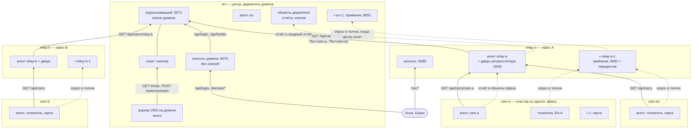

# Камера, офис, центр: вся установка в запросах

> [!note] Записки поверх репозитория, а не его документация
> Это разбор: я читал код и восстанавливал по нему, как всё устроено, максимально простыми словами.
> **Источник истины — код.** Где записки расходятся с кодом, прав код.
> Проект описывает себя сам: [`README.md`](../../README.md) и указатели модулей.
> Состояние: коммит `9101631`, 10 октября 2026.

[← карта разбора](README.md) · вперёд: [01-reference.md](01-reference.md)


Один сценарий, разобранный до каждого запроса. Установщик основывает домен на сервере центра. Офисы и камеры вступают в него. Камера загружается, домен узнаёт о ней, офис объявляет, что будет её писать, и камера начинает толкать поток. Потом человек в центре открывает эту камеру и смотрит.

Документ отвечает на вопрос «кто кому что шлёт и что получает в ответ» — от первой строки в хранилище центра до кадра, который увидел зритель. Последние части отвечают на два других вопроса: что ломается и как это выглядит в запросах, и чего такое устройство стоит.

Что в разборе взято из кода, что задано стендом, а что условно, — в [карте разбора](README.md). Там же главная оговорка: какая стрелка в трассе — настоящий HTTP курса, а какая — вызов функции, напечатанный словами продукта.

---

## Вся установка пятью фразами

> [!important] Если запомнить только одно
> **Каждая камера с прошивкой w2c — кластер из одного.** У неё своё хранилище на флеше и один писатель, она сама берёт себе эпоху при каждой загрузке, и никто её не размещает (`vms/domainpart/device.py:1-27`).
>
> **Каждый офис — тоже кластер, и в его регистраторе живут приёмник и передатчик.** Камера толкает поток в приёмник офиса, регистратор офиса его пишет, а передатчик несёт поток в центр, когда центр его хочет (`vms/recworker.py:1227`, ADR-0065). Для камеры, которой виден только офис, он ещё и дорога к домену (`w2cplatform/domain/relay.py:1-20`).
>
> **Центр держит домен.** Подписывающий — единственный процесс с ключами домена. Консоль домена — дверь людей, ключей у неё нет. Воркер VMS на домене пишет книги для каждого члена: кто какую камеру пишет и куда толкать (`signer_service.py:1-15`, `console.py:1-14`, `vms/domainpart/worker.py:1-12`). У центра есть и свой регистратор с приёмником — для зрителя.
>
> **Каждый уровень звонит на уровень выше и никогда наоборот.** Камера звонит офису, офис звонит центру, центр не звонит никуда (`relay.py:1-20`; М12B, [урок 4](../../М12B_DomainVMS/04-a-chain-site-relay-centre.md)).
>
> **Домен — каталог каталогов, и ему разрешено лечь.** Кластеры работают по тому, что агенты уже принесли домой: ключам, правам, книгам. Видео через домен не идёт вовсе (`w2cplatform/domain/agent.py:1-12`; М12A, [README](../../М12A_Domain/README.md)).

Две оговорки, иначе картинка съедет.

**Видео не идёт через хранилище и не идёт через домен.** В книге лежит только адрес приёмника, `http://relay-a:8091/ingest`, и токен, с которым туда толкать. Сам поток идёт мимо: камера — приёмник офиса — приёмник центра.

**Провод между камерой и приёмником есть только у продукта.** В курсе приёмник и передатчик — объекты в одном процессе, и камера зовёт их методы (`vms/domainpart/ingest.py:405`). Трасса печатает такой вызов словами маршрута продукта, `GET /ingest/SN-A/poll`, с пометкой (М12B, [`module-design.md`](../../М12B_DomainVMS/module-design.md), «Что открыто», пункт 5).

### Что из этого следует

Шесть вещей, которые обычно не укладываются в голове с первого раза.

**Член не читает у держателя ничего.** Ни офис, ни камера не видят хранилища центра. Своё они просят у двери домена, `GET /api/carry/<член>`, и подписывают запрос ключом члена. Дверь отвечает только строками этого члена (`w2cplatform/domain/carry.py:1-24`). Иначе права, которые дали бы члену его строки, дали бы ему и чужие: строки соседей лежат под теми же префиксами.

**Все соединения открывает тот, кто ниже.** Камера сама держит опрос приёмника офиса, сама толкает кадры, её агент сам ходит за книгами и сам кладёт отчёт (`ingest.py:30-33`). До камеры за NAT на сотовом канале не дозвониться никому, поэтому на неё никто и не звонит.

**Секрет нигде не лежит открытым.** У держателя секреты запечатаны его кольцом (ключом шифрования платформы, `SECRETS_KEY`). В ответе двери — ключу члена, которому ответ. Дома у члена — кольцом члена (М12A, [урок 15](../../М12A_Domain/15-domain-secrets.md)). Поэтому копия хранилища — не копия секретов, а офис, через который идёт ответ для камеры, не может его открыть.

**Ключи домена — у одного процесса.** Подписывающий держит ключи и делает всё, что ими подписывается: вход человека, токены для книг, запись срока. Консоль домена только передаёт ему просьбу человека как есть (ADR-0032). Поэтому захват консоли домена не даёт ни одной подписи.

**Домену можно лечь.** Пока центр выключен, офис пишет камеру по книге, которую агент принёс последней, а камера толкает по токену потока, который у неё уже есть, — до конца его суток (`vms.subsystem.yaml:414`). Новые люди не входят, новые решения не принимаются. Что ломается на исходе суток, — в части 10.

**Решение «кто пишет камеру» одно, и оно у держателя.** Камеру `SN-A` пишет кластер `relay-a` — это одна строка `domain/vms/crossings`. Книги для офиса и для камеры — её следствие, их пересчитывает каждый проход воркера VMS на домене. Само решение едет в резервной копии домена (`domain.kept: [crossings, roads, …]`, `vms.subsystem.yaml:407`), поэтому переживает перенос держателя.

### Жизнь камеры сверху вниз

| Шаг | Кто | Что делает | Сколько ждать | Часть |
|---|---|---|---|---|
| 1 | установщик на `srv` | основывает домен: корень вне держателя, первый набор ключей и запись держателя срока 1 подписаны корнем | один раз | [2](02-founding-the-domain.md) |
| 2 | агенты офисов и камер | при первом старте делают ключ члена и печатают его отпечаток | при установке | 3 |
| 3 | оператор и Анна на `srv` | регистрируют ключи членов, принимают камеры, пишут топологию: камеры ходят через свои офисы | руками | 3 |
| 4 | агент офиса | первый `GET /api/carry/relay-a`: ключи домена, запись держателя, топология, список членов; потом то же за каждую свою камеру (`?for=cam-a`) | до 30 с (`SYNC_INTERVAL`) | 3 |
| 5 | камера `cam-a` | загружается: эпоха, строка `vms/cameras/1` с `ref=SN-A`, heartbeat и срез снапшота в памяти, дверь после публикации; карта — том, запись `1-sd` на ней | при включении | 4 |
| 6 | агент камеры, агент офиса | отчёт камеры — в объекты офиса, сводный отчёт офиса — в объекты держателя; домен видит `SN-A` | до 30 с на звене | 4 |
| 7 | Анна на консоли `relay-a` | объявляет том `disk` и запись `SN-A` с камерой `ref:SN-A` | руками | 5 |
| 8 | воркер VMS на домене | решение «`SN-A` пишет `relay-a`»; книги: источников — офису, основных — камере (куда толкать и токен потока), `upstream` — офису (куда нести в центр) | до 5 с (`BOOKS_EVERY`) | 6 |
| 9 | агенты | несут книги домой: офис — у двери домена, камера — у двери офиса | до 30 с | 6 |
| 10 | камера и регистратор офиса | камера держит опрос приёмника офиса, слышит «толкай» и толкает кадры; регистратор офиса пишет | около секунды на опрос | 7 |
| 11 | Борис в центре | открывает `SN-A`: желание идёт вниз через передатчик офиса до камеры, поток — вверх; ушёл — через 10 с (`LINGER`) центр поток больше не хочет | секунды | 8 |

Интервалы — умолчания кода: агент проходит раз в 30 с (`agent.py:663`), подписывающий — раз в 5 с (`signer_service.py:914`), воркер VMS на домене — раз в 5 с (`vms/domainpart/worker.py:226`), `LINGER` — `ingest.py:122`.

На шаге 10 у трасс есть оговорка. На момент трасс регистратор офиса поток, который камера толкает в его же приёмник, не брал: запись `SN-A` стояла `waiting`, «camera held by nobody», и подписку на приёмник от имени регистратора делал сценарий (находка O6). Часть 7 будет написана по трассам, снятым после исправления.

Между шагами никто никого не будит. Каждая стрелка здесь — чья-то запись и чьё-то чтение секундами позже, или чей-то запрос вверх на следующем проходе.

---

## Стенд

Семь кластеров, и у каждого один сервер с тем же именем: в первой установке кластер — одна коробка. Каждый серверный кластер — кластер стенда М11 (`Source/tests/cluster/conftest.py`): хранилище `configstore` за дверью на каждую роль с правами из закоммиченного файла, ресурс со своими объектами (`stand.py:1-25`, `clusters.py`). Камера — кластер из одного, как его строит курс (`DeviceCluster`, М12A, [урок 10](../../М12A_Domain/10-a-cluster-of-one.md)): её хранилище — флеш, одна заглушка `FakeVariables` на камеру.

| Кластер | Роль | Что в нём работает (имена в трассе) | `REACHES` | `index` от |
|---|---|---|---|---|
| `srv` | центр, держатель домена | `signer on srv` — подписывающий (`w2c-domain`); `domain console on srv` — консоль домена (`w2c-domain-console`); `domainagent on srv` — агент держателя; `vmsdomain on srv` — воркер VMS на домене (`vms-domainpart`); `console on srv` — консоль кластера; `recworker r-srv-1` с приёмником; ресурс | `vlan:centre` | 1000 |
| `relay-a` | офис объекта A | `console on relay-a`; `domainagent on relay-a` с дверью ретранслятора (`RELAY=1`, `REPORT=1`); `recworker r-relay-a-1` с приёмником и передатчиком; контроллеры VMS и записи; ресурс | `vlan:site-a,vlan:uplink` | 2000 |
| `relay-b` | офис объекта B | то же | `vlan:site-b,vlan:uplink` | 3000 |
| `cam-a` | камера `SN-A` на объекте A | сама камера (`DeviceCluster`: строка, эпоха, heartbeat и срез в памяти); `recworker r-1` — регистратор карты над кольцом камеры; `pusher on cam-a` — толкатель; `domainagent on cam-a` (`RELAY_URL` — дверь `relay-a`) | `vlan:site-a` | 4000 |
| `cam-a2` | камера `SN-A2` у ворот объекта A: видит машины, кольцо маленькое (50 000 байт) | то же | `vlan:site-a` | 5000 |
| `cam-b` | камера `SN-B` на объекте B, на сотовом канале, поворотная (8 пресетов) | то же, через `relay-b` | `lte:cam-b` | 6000 |
| `relay-b2` | резервный офис, только в отказе 9: пишет `SN-A`, пока `relay-a` не пишет | `recworker r-relay-b2-1` | `vlan:site-b,vlan:site-a,vlan:uplink` | 7000 |

Состав, досягаемость, умения камер и топология заданы в `stand.py:34-58`. `REACHES` — слова площадки для сетей, которые кластер видит сам (`deploy/domain/systemd/domain.env.example:10`). `index от` — база номеров хранилища этого кластера на стенде: так в одной трассе у разных кластеров не бывает одинаковых номеров.

Имена кластеров, серийные и порты взяты у ночного стенда продукта (`vmssubsystem/scripts/nightly/stand.sh:18-42`), чтобы читатель узнал их, когда откроет стенд продукта. Вторую камеру объекта A я назвал `cam-a2`, а не `cam-c`: у продукта `cam-c` стоит за `relay-c`, которого здесь нет.

У подписывающего на `srv` строка `CLUSTERS` — `srv,relay-a=http://relay-a:8080,relay-b=http://relay-b:8080`. Это кластеры, которые домен знает из конфигурации, с адресами их консолей. Камер в ней нет: консоли камеры никто не достаёт, и в домен камеры входят по списку членов, который пишет человек (`stand.py:242-247`; часть 3).

### Кто до кого дотягивается

| Кто | Звонит на | Что идёт |
|---|---|---|
| камера | приёмник своего офиса, `relay-a:8091` | медиа: опрос «есть ли работа», толчок кадров, ответы на заявки с карты |
| | дверь ретранслятора своего офиса, `relay-a:8446` | книги и ключи вниз — `GET /api/carry/cam-a` |
| | объекты своего офиса | отчёт о себе вверх |
| офис | дверь домена, `srv:8071` | книги и ключи — свои и своих камер (`?for=`) |
| | объекты держателя на `srv` | свой отчёт и сводный отчёт за камеры |
| | приёмник центра, `srv:8091` | медиа, когда центр его хочет |
| | консоли кластеров из `CLUSTERS` | кто сейчас держит домен (`GET /api/held`) |
| центр | никуда | — |
| люди | консоль домена `srv:8070`, консоли кластеров `:8080` | вход, решения, просмотр |

Это правило М12B, [урок 4](../../М12B_DomainVMS/04-a-chain-site-relay-centre.md): каждый уровень должен быть достижим снизу и никогда — сверху. Офису достаточно одного проброшенного порта приёмника и двери ретранслятора для своих камер. Центру — быть достижимым для всех.



Сплошная стрелка — настоящий HTTP курса. Пунктирная — вызов в одном процессе, у которого провод есть только у продукта: медиа между приёмниками и отчёт члена в чужие объекты. Каждая стрелка идёт снизу вверх, и на стенде её открывает тот, кто ниже. Хранилище каждого кластера на схеме не нарисовано: каждый процесс ходит в хранилище **своего** кластера через сокет своей роли, и ни один — в чужое.

### Что стенд упрощает

**Ничего не работает само.** Каждый проход каждого процесса зовёт сценарий, по порядку (`stand.py:20-25`). Поэтому трасса одинакова от прогона к прогону. На живой установке те же проходы идут каждый по своему таймеру.

**Часы одни на весь стенд** и идут, только когда сценарий скажет (`tracing.py:46-62`). Расхождение часов камеры и офиса — отдельная сцена отказа.

**Прошивки нет.** Кадры камеры — поддельные: десять в секунду, ключевой каждые две секунды (`stand.py:877-893`). У продукта кадры приходят из сокета кадров прошивки.

**Приёмник в регистраторе поднимает сценарий.** Процесс регистратора курса приёмник не поднимает; сценарий делает это так же, как тесты (`stand.py:697-706`; М12B, `module-design.md`, «Что открыто», пункт 5).

**Одна накладка на права.** На момент трасс роли регистратора не было дано чтение трёх книг, которые читают его приёмник и передатчик (находка F3). Ручка приёмника и передатчика в сценарии — та же роль с этими чтениями сверх файла прав, и каждая её строка в трассе помечена дверью `/run/configstore/recworker.sock (+F3)`. Своя ручка регистратора — как в файле.

---

## Как читать запись в трассе

Каждая запись — строка «кто → куда», под ней запрос, под ним ответ. Строка `#` говорит, кто спросил и через какую дверь. Видов записей семь.

**Хранилище своего кластера.** Процесс ходит в `configstore` через unix-сокет своей роли. Демон знает, кто звонит, по сокету, в который пришёл запрос (М11, [урок 5](../../М11_Cluster/05-rights-by-who-is-calling.md)).

```
# vmsdomain on srv → /run/configstore/vmsdomain.sock
POST /v1/write {"op": "put", "key": "domain/vms/worker", "cas": "", "items": {
  "instance": "srv:1201:0004b1",
  "at": "1757500000.0"
}}
→ 200 {"index": 1010}
```

Запросов к хранилищу три: прочитать ключ (`GET /v1/get`), перечислить ключи по префиксу (`GET /v1/list`) и записать или удалить ключ (`POST /v1/write`). `cas` — условие записи: `""` значит «только если ключа ещё нет», число — «только если версия ключа сейчас такая». Подробно — в [справочнике](01-reference.md).

**Флеш камеры.** То же, но у камеры нет демона хранилища: это одно хранилище одного писателя (`tracing.py:567-605`).

```
# domainagent on cam-a → the flash of cam-a
POST /v1/write {"op": "put", "key": "domain/member-key", "cas": 0, …}
→ 200 {"index": 4001}
```

**HTTP между процессами.** Адрес напечатан, как его видит установка, с портом стенда. Заголовки, которые важны для рассказа, — под строкой запроса.

```
# domainagent on relay-a → srv:8071
GET /api/carry/relay-a
  X-W2C-Time: 1757500060.000
  X-W2C-Seal: «ключ 2»
  X-W2C-Signature: «подпись 1»
→ 403 {"detail": "relay-a is no member with a key: …"}
```

**Ответ, напечатанный позже.** Если запрос сам вызвал другие запросы, сначала стоит `→ …`, потом то, что он вызвал, и только потом ответ со стрелкой `←`:

```
# anna → srv:8070
POST /domain/members {"name": "cam-a"}
→ …

# domain console on srv → /run/configstore/domainconsole.sock
POST /v1/write {"op": "put", "key": "domain/members", …}
→ 200 {"index": 1018}

# anna ← srv:8070: ответ на POST /domain/members
→ 200 {"rev": 1, …}
```

**Объекты.** Большие и частые записи — отчёты, вид домена, heartbeat'ы — лежат не в хранилище, а файлами на сервере писателя. Свои процесс пишет на свой диск; чужие читает через ресурс своего сервера (М11, [урок 6](../../М11_Cluster/06-what-stays-on-the-server.md)).

```
# signer on srv → the resource on srv, http://srv:8090
GET /v1/objects/domain/members/relay-a/reported?scope=cluster
→ 404

# signer on srv → its own files on srv
PUT domain/view
```

**Вызов, напечатанный словами продукта.** Вторая строка `#` с отступом говорит, что это у курса и что у продукта:

```
# pusher on cam-a (SN-A) → relay-a:8091 (the ingest of r-relay-a-1)
#   в курсе — вызов Ingest.poll в процессе; у продукта GET /ingest/SN-A/poll (recproc/ingest.go)
GET /ingest/SN-A/poll {"camera_now": 1757500261.0, "version": -1, "wait": 0.0}
  Authorization: Bearer «токен 1: stream sub=cam-a aud=ingest:relay-a ref=SN-A на 86400 с»
```

**Строка сценария.** `##` — не запрос, а слова сценария: что сейчас происходит, что агент напечатал в журнал, какая находка тут видна и как сценарий её обходит.

```
## агент relay-a печатает при первом старте: member key «ключ 1», fingerprint f2a47a68b9e3621f,
## sealing key «ключ 2»
```

## Три уровня записей

В «Трёх камерах» уровней было два: человек и консоль, процесс и хранилище. Здесь добавляется третий, и он главный.

**Уровень 1 — человек и консоль.** Обычный REST: `POST /api/login`, `POST /domain/members`, `PUT /domain/topology` на консоли домена; `POST /rec/recordings` на консоли офиса. Это то, что видит браузер. Права человека консоль кластера проверяет сама, по ключам и правам, которые принёс её агент; консоль домена — по правам домена (раздел «Права людей» в [справочнике](01-reference.md)).

**Уровень 2 — процесс и хранилище своего кластера.** `GET /v1/get`, `GET /v1/list`, `POST /v1/write` через сокет роли; рядом — файлы объектов на своём сервере. Ни один процесс не пишет в хранилище чужого кластера: подписывающий пишет только на `srv`, агент офиса — только на `relay-a`.

**Уровень 3 — кластер и кластер.** Всё, что пересекает границу кластера: агент — дверь домена или дверь ретранслятора; отчёт вверх; медиа камера — приёмник офиса — приёмник центра; агент — консоли кластеров (`/api/held`). На этом уровне каждая стрелка идёт снизу вверх, и каждую открывает тот, кто ниже. Здесь же живут оба вида записей «в курсе — вызов, у продукта — провод».

Один шаг человека превращается в записи всех трёх уровней. Анна принимает камеру — это запрос уровня 1, запись `domain/members` уровня 2 на `srv` и, на следующем проходе агента офиса, ответ двери домена уровня 3 с новым списком членов. Ровно это части ниже и расписывают.

---

[← карта разбора](README.md) · вперёд: [01-reference.md](01-reference.md)
