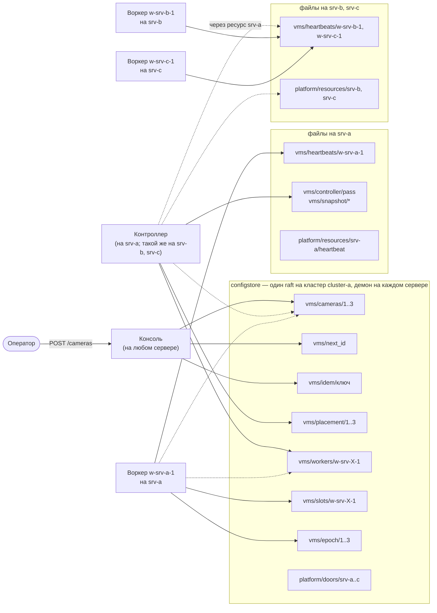

# Три камеры на три сервера: полный путь в запросах

> [!note] Записки поверх репозитория, а не его документация
> Это разбор: я читал код и восстанавливал по нему, как всё устроено, максимально простыми словами.
> **Источник истины — код.** Где записки расходятся с кодом, прав код.
> Проект описывает себя сам: [`README.md`](../../README.md) и указатели модулей.
> Состояние: коммит `970e5a7`, 4 октября 2026.

[← карта разбора](README.md) · вперёд: [01-reference.md](01-reference.md)


Один сценарий, разобранный до каждого HTTP-запроса. Оператор создаёт три камеры в кластере из трёх серверов. Контроллер раскладывает их по одной на сервер. Воркеры забирают свои камеры и подтверждают, что запустили.

Документ отвечает на вопрос «кто что кому шлёт и что получает в ответ» — от `POST /cameras` до момента, когда консоль показывает `phase: running` и `observed_revision == revision`. Последняя часть отвечает на другой вопрос: чего такое устройство стоит и на каком размере кластера оно кончается.

## Что здесь взято из кода, а что придумано

**Из кода**: пути ключей, HTTP-методы, порядок вызовов, поля тел запросов и ответов, интервалы проходов, текст причин размещения, правило выбора воркера, права сокетов. Кода здесь нет — всё показано так, как оно идёт по сети: запрос, ответ, данные.

**Условное**: имя кластера, значения `index`, отметки времени, содержимое полей камер. `index` в трассах начинается с 1000 — так стенд задаёт базу хранилища — и растёт с каждой принятой записью, поэтому по нему виден порядок записей. На живом кластере числа будут другими.

**Посчитанное на стенде, а не измеренное на кластере**: все числа [части 10](10-limits-and-scale.md) про нагрузку. Они сняты прогоном настоящего кода над хранилищем в памяти — сколько чтений делает проход, сколько байт весит запись, — и ни одно из них не снято с работающего кластера. Где для вывода не хватает замера, стоит пометка `[TODO]`.

**Чего здесь нет**: записи в архив (подсистема `rec`), раздачи потоков зрителям (`live`), детекции (`det`) и доменного слоя. Про них — в [части 9](09-whats-missing.md).

---

## Вся система пятью фразами

> [!important] Если запомнить только одно
> **Источник правды для всех процессов — хранилище ключ-значение**, то есть `configstore`: один демон на каждом сервере, три демона держат одни и те же строки через raft. Процессы не разговаривают друг с другом вообще: всё, что один знает о другом, — это ключ, который тот записал, или файл, который тот выложил на своём сервере. Значение ключа — плоский набор строк, и ничего сложнее строк там не лежит.
>
> Две оговорки, иначе картинка съедет. **Видео через хранилище не идёт**: в ключе лежит только адрес вида `rtsp://srv-a:8554/1`, а сам поток идёт мимо, напрямую с воркера. И **фактическое состояние живёт на воркере**, а в кластере лежит только его рассказ о себе — файл на его сервере, свежестью в один такт, не свежее.

Воркер при старте берёт себе имя — занимает слот — и дальше раз в десять секунд рассказывает о себе: кто он, на каком сервере стоит, сколько камер потянет, что у него сейчас запущено. Консоль принимает камеру от оператора и кладёт её настройки в хранилище; на этом её работа кончается, потому что где камере работать — не её дело. Контроллер раз в пять секунд смотрит, какие камеры лежат без размещения и какие воркеры о себе рассказали, и раскладывает первое по второму — тоже просто записью в хранилище. Воркер раз в две секунды перечитывает, что ему назначили, и поднимает у себя эти камеры. Ни один из них не зовёт другого напрямую: каждый пишет своё и читает оттуда чужое.

Почему так, а не вызовами по сети: любой из них может умереть в любую секунду, и тогда вызов некому принять. Запись в хранилище дожидается адресата сама, поэтому упавший процесс ничего не теряет — он вернётся и дочитает.

Четвёртый участник в этом рассказе не назван, хотя без него камеру не разместят. Ресурс — это процесс платформы, который отвечает за диски и файлы своего сервера, раз в десять секунд говорит, что жив, и отдаёт соседям файлы своего сервера. Он же знает, какие процессы на его сервере живы: каждый воркер при старте у него регистрируется. Воркер без живого ресурса камеру не получит, потому что ему некуда будет писать события.

### Что из этого следует

Шесть вещей, которые обычно не укладываются в голове с первого раза.

**Никто никого не уведомляет.** Нет ни подписок, ни событий, ни вызова «эй, я тебе камеру назначил». Каждый процесс ходит по кругу и сам смотрит, что изменилось. Поэтому воркер, который лежал в момент размещения, ничего не пропустил — он догонит на ближайшем круге.

**Молчание — это тоже сообщение.** Умерший не успевает сказать, что умер. Поэтому живость меряется свежестью последнего рассказа о себе, а не ответом на запрос: heartbeat старше 45 секунд означает «этого воркера больше не считаем».

**У каждого ключа ровно один писатель.** Настройки камер пишет консоль, размещение — контроллер, эпохи и слоты — воркер. Делит их не договорённость в коде, а сокет: каждый процесс ходит к демону хранилища своего сервера через сокет своей роли, и запись в чужой ключ демон отклоняет `403` ещё до того, как переслать её дальше. Исключение одно — строка слота, её пишут и воркер, и контроллер, оба с условием по версии; разбор в [справочнике](01-reference.md).

**Желаемое и фактическое лежат в разных местах.** Строка камеры в хранилище — что оператор захотел. Heartbeat воркера, файл на его сервере, — что на самом деле работает. Сложить их в один ключ значит завести кэш, который врёт: зелёная строчка в консоли над коробкой, которая ничего не пишет.

**Ни у кого нет состояния в памяти.** Любой процесс можно убить посреди работы и поднять заново — всё, что он знает, он перечитывает из хранилища и файлов. Отсюда и то, что контроллеров на кластере три, по одному на сервер, и это не страшно.

**Споры решает хранилище, а не код.** Везде, где двое могут сделать одно и то же — выдать номер новой камере, занять имя `w-srv-a-1`, начать держать камеру 7, разместить её двумя контроллерами сразу, — выигрывает тот, чья запись прошла первой. Один приём, условная запись, закрывает все эти случаи.

### Жизнь камеры сверху вниз

| Шаг | Кто | Что делает | Сколько ждать |
|---|---|---|---|
| 1 | оператор → консоль | `POST /cameras`; консоль пишет `vms/cameras/1` и честно отвечает «создана, нигде не работает» | сразу |
| 2 | контроллер | видит камеру без размещения, выбирает воркера с наибольшей свободной ёмкостью, пишет `vms/placement/1` и `vms/workers/w-srv-a-1` | до 5 с |
| 3 | воркер `w-srv-a-1` | видит себя в назначении, читает строку камеры, берёт эпоху и поднимает пайплайн | до 2 с |
| 4 | воркер `w-srv-a-1` | выкладывает heartbeat: камера 1 в фазе `running` на ревизии 1 | до 10 с |
| 5 | консоль | читает heartbeat через ресурс своего сервера и показывает это оператору | сразу при запросе |

Между шагами 1 и 2 никто никому не звонил. Между 2 и 3 — тоже. Каждая стрелка здесь — это чья-то запись и чьё-то чтение несколькими секундами позже.

---

## Стенд

Кластер из трёх серверов: `srv-a`, `srv-b`, `srv-c`. Кластер зовётся `cluster-a`: так его называют срезы снапшота в трассах (имя по умолчанию, `CLUSTER` в коде; оговорка — в [карте разбора](README.md)). Оркестратора нет: на каждом сервере `systemd` запускает один и тот же набор юнитов (М11, [урок 3](../../М11_ClusterVMS/03-units-on-every-server.md)), и каждый юнит открывает сокет своей роли у демона хранилища этого сервера (М11, [урок 5](../../М11_ClusterVMS/05-rights-by-who-is-calling.md)).

| Юнит на каждом сервере | Процесс | Сокет хранилища | Пишет в хранилище | Файлы на своём сервере |
|---|---|---|---|---|
| `configstore.service` | демон хранилища, член группы raft | открывает сокеты ролей и `admin.sock` | — | — |
| `w2c-resource.service` | ресурс | `resource.sock` | `platform/doors/*` — где он отвечает и когда последний раз сказал, что жив (`at`, раз в 15 с) | свой heartbeat; отдаёт соседям файлы своего сервера |
| `vms-console.service` | консоль, порт 8080 | `console.sock` | `vms/cameras/*`, `vms/next_id`, `vms/idem/*`, `vms/retention/*`, `vms/alarms_retention/*`, `vms/requests/*`, `vms/policy`, `vms/servers/*`, `vms/sweep`, `platform/drain`, `platform/decommission/*` (и строки записи под `rec/`) | — |
| `vms-vmscontroller.service` | контроллер камер | `vmscontroller.sock` | `vms/workers/*`, `vms/placement/*`, `vms/slots/*`, `vms/decommissioned/*` | отчёт прохода, срезы снапшота |
| `vms-vmsworker.service` | воркер `w-<сервер>-1` | `vmsworker.sock` | `vms/epoch/*`, `vms/slots/*`, `vms/holds/*`, `vms/devices/*`, `objects/vms/commands/*` | свой heartbeat |
| `vms-vmsworker-spare@.service`, `vms-recworker-spare@.service` | запасной воркер `vms-vmsworker-spare@<n>` (и регистратор) — шаблон: юнит роли строка в строку, но без имени | как у юнита роли | как у юнита роли | как у юнита роли |
| `w2c-spares.timer`, `w2c-spares-vmsworker.timer` | `w2c-spares.sh` раз в минуту, от пользователя `w2c-spares` | никакого | ничего | ничего; пишет только `/run/w2c-spares/<юнит>.env` |

Права в этой таблице — из файла прав `clustervms/deploy/configstore-rights.json`. Его генерирует код (`python3 -m cluster rights`), и человек его не правит; полная таблица, с чтениями, — в [справочнике](01-reference.md). Юниты регистратора (`vms-recworker`, `vms-reccontroller`) и движка архива на серверах тоже стоят, но в нашем сценарии не участвуют. Шаблоны запасных и таймеры скрипта ставит только `install.sh --spares`; включёнными они не стоят, экземпляр шаблона запускает скрипт (М11, [урок 3](../../М11_ClusterVMS/03-units-on-every-server.md), шаг 1).

Две формы юнитов стоит заметить сразу. **Консоль, ресурс и воркер — по одному на сервер, с перезапуском на месте**: `Restart=always`, `RestartSec=2`, упавший процесс поднимается через две секунды на том же сервере и под тем же именем. **Контроллер стоит на каждом сервере, и их три одновременно**: каждый проход он перечитывает всё и пишет только по CAS, так что два контроллера сделают одно и то же, а хранилище пропустит одну запись из двух (М11, урок 10). В трассах проход делает контроллер на `srv-a`.

Сколько воркеров на сервере, решает администратор юнитами: стоит один юнит `vms-vmsworker.service` — работает один воркер. Имя ему даёт юнит, `WORKER_NAME=w-%l-1`, где `%l` — короткое имя хоста. Так получились `w-srv-a-1`, `w-srv-b-1`, `w-srv-c-1`. Контроллер процессов не запускает. Когда камерам не хватает места, он считает, скольких воркеров не хватает, и пишет предложения слотов. Скрипт `w2c-spares.sh` на каждом сервере по таймеру читает это число со страницы метрик консоли и поднимает запасной процесс из шаблона: пишет набор меток строкой `SPARE_FOR=…` в `/run/w2c-spares/vms-vmsworker-spare@<n>.service.env` и делает `systemctl start vms-vmsworker-spare@<n>`. Скрипт работает не от root, а от своего пользователя `w2c-spares`: тот не входит ни в одну группу, кроме своей, сокета хранилища и ключа у него нет, а polkit разрешает ему только `start` экземпляров двух шаблонов запасных (`w2c-spares.rules`). Запасной — тот же юнит воркера, с тем же пользователем, сокетом и ключом, только без `WORKER_NAME` и с портом раздачи, который выдаст ОС (`RTSP_PORT=auto`). Разбор — в разделе [8.8](08-failures.md) и в М11, [уроке 4](../../М11_ClusterVMS/04-a-name-is-a-slot.md).

У всех воркеров `CAPACITY=50` (`/etc/vms/vms.env`). Все три сервера объявили метку `vlan:cctv`: администратор записал `LABELS=vlan:cctv` в `/etc/w2c/w2c.env` каждого сервера. Это файл платформы, а не строка юнита, потому что метка — свойство сервера, а не роли. Скрипт запуска `w2c-run.sh` отдаёт её процессу, воркер сообщает её в heartbeat, и по ней контроллер решает, кому камера достижима. Оба файла лежат на разделе данных, а `/etc/w2c` и `/etc/vms` — ссылки на `/data/platform/etc` и `/data/vms/etc`; ссылки кладёт `install.sh` (М11, урок 3). Строк `vms/servers/<сервер>` с метками из консоли на стенде нет. Что это за метка и как её правят из консоли — раздел [4.1](04-placement.md).



Сплошная стрелка означает «пишет», пунктирная — «только читает». Все они асинхронные: процесс кладёт запись и не ждёт, пока её кто-нибудь заметит.

Строки хранилища одни на весь кластер: что записано через демон `srv-a`, то следующим же чтением видно через демон `srv-c`, потому что любое чтение отвечает лидер группы. Объекты — heartbeat'ы, отчёт прохода, срезы снапшота — лежат файлами только на сервере того, кто их пишет. Чужие объекты процесс читает через ресурс своего сервера (`GET /v1/objects…?scope=cluster`), а тот спрашивает ресурсы остальных серверов.

Между процессами нет ни одной стрелки. Консоль не зовёт контроллер, контроллер не зовёт воркеров. Всё общение идёт через хранилище и файлы, потому что так любой из них может умереть и вернуться, ничего никому не сообщая.

## Как читать запросы дальше

Уровней два, и путать их не стоит.

**Уровень 1 — оператор и консоль.** Обычный REST: `POST /cameras`, `GET /where/1`. Это API консоли, его видит браузер.

**Уровень 2 — любой процесс и хранилище.** HTTP API демона `configstore` через unix-сокет роли: `GET /v1/get`, `GET /v1/list`, `POST /v1/write`. Туда ходят все четыре процесса стенда — консоль, контроллер, воркер и ресурс, — каждый через свой сокет. Рядом идут файлы: процесс пишет объект файлом на своём сервере и читает чужие через ресурс.

Один запрос оператора всегда превращается в несколько запросов к хранилищу. Ровно это ниже и расписано.

Записи запросов в частях 2–8 сняты прогоном кода курса на его стенде (`М11_ClusterVMS/clustervms/tests/stand.py`, коммит `970e5a7`). На стенде настоящие консоль, контроллер, воркеры и ресурсы ходят через настоящую клиентскую ручку хранилища в его машину состояний и с правами из файла прав курса. Каждый запрос записан так, как ручка положила бы его в сокет. Консоль поднята настоящая и отвечает по HTTP. Строка над запросом говорит, кто и через какой сокет его отправил:

```
# vmsworker w-srv-a-1 on srv-a → /run/configstore/vmsworker.sock
POST /v1/write {"op": "put", "key": "vms/slots/w-srv-a-1", "cas": "", "items": {…}}
→ 200 {"index": 1004}
```

Значения `index` и отметки времени в записках условные (см. выше), а пути, методы, тела, порядок и сокеты — из прогона.

---

[← карта разбора](README.md) · вперёд: [01-reference.md](01-reference.md)
