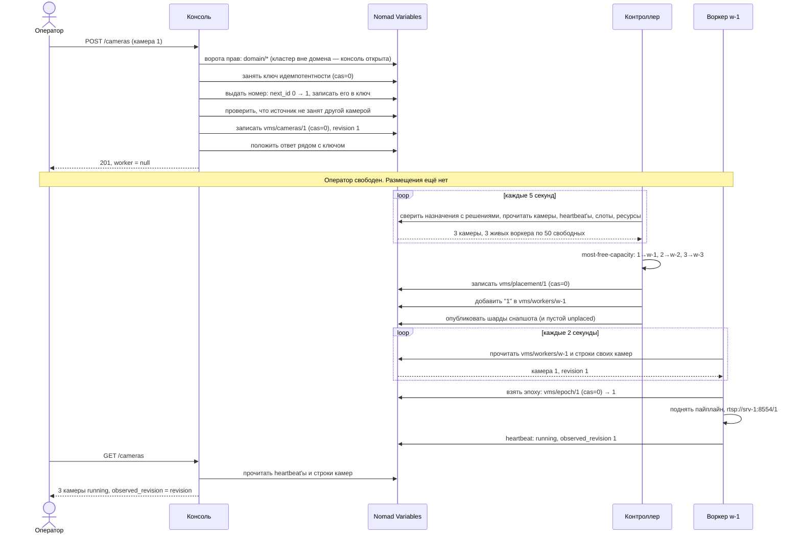

# Часть 6. Подтверждение: как оператор убеждается, что всё встало

> [!note] Записки поверх репозитория, а не его документация
> Это разбор: я читал код и восстанавливал по нему, как всё устроено, максимально простыми словами.
> **Источник истины — код.** Где записки расходятся с кодом, прав код.
> Проект описывает себя сам: [`README.md`](../../README.md) и указатели модулей.
> Состояние: коммит `2b66bea`, 2 октября 2026.

[← карта разбора](README.md) · назад: [05-workers-and-epochs.md](05-workers-and-epochs.md) · вперёд: [07-edit-and-delete.md](07-edit-and-delete.md)


Три разных вопроса — три разных ответа, и источники у них разные.

## 6.1. «Покажи мне все камеры» — `GET /cameras`

Консоль отвечает из **двух** источников сразу, и это принципиально:

```
GET /cameras HTTP/1.1
Host: srv-1:8080
```

```json
{
  "rows": [
    {
      "id": 1,
      "ref": "north-gate",
      "name": "Ворота",
      "enabled": true,
      "phase": "running",
      "position": "converged",
      "revision": 1,
      "observed_revision": 1,
      "epoch": 1,
      "live_url": "rtsp://srv-1:8554/1",
      "live_shm": "shm:///run/vms/1.shm",
      "worker": "w-1",
      "server": "srv-1",
      "age": 1.7,
      "worker_state": "live"
    },
    {"id": 2, …, "worker": "w-2", "server": "srv-2", "age": 1.7, "worker_state": "live"},
    {"id": 3, …, "worker": "w-3", "server": "srv-3", "age": 1.7, "worker_state": "live"}
  ],
  "configured": [
    {
      "id": 1,
      "name": "Ворота",
      "source": "driverpack://acme/10.2.0.11",
      "enabled": true,
      "events_retention_days": null,
      "alarms_retention_days": null,
      "priority": 100,
      "labels": ["vlan:cctv"],
      "folders": [],
      "alarms": null,
      "ref": "north-gate",
      "cred_username": "operator",
      "cred_secret": "***",
      "live": "always",
      "kind": "video",
      "revision": 1
    },
    {"id": 2, …},
    {"id": 3, …}
  ]
}
```

`configured` — из строк камер, это **желаемое**. Им заполняются формы редактирования. `null` у сроков хранения и у тревог значит «не задано, наследуется» (раздел [4.5](04-placement.md)); `cred_secret` замаскирован, как на любом выходе из консоли.

`rows` — из heartbeat'ов воркеров, это **фактическое**. Отсюда берутся `phase`, `epoch`, `observed_revision` и возраст отчёта.

Смешивать их в один список нельзя, и причина простая: если сложить статус в хранилище настроек, получится кэш, который врёт — зелёная строчка в консоли над коробкой, которая ничего не пишет.

Что при этом ушло в Nomad:

```
# ворота: состоит ли кластер в домене, и тогда — кто звонит
GET /v1/var/domain/keys                       → 404
GET /v1/var/domain/member, root, grants, revoked, break_glass → 404   пять отметок членства
… те же шесть чтений ещё раз: «кто звонит» и «можно ли ему» спрашиваются по отдельности

# фактическое — дёшево, зависит от числа воркеров, а не камер
GET /v1/vars?prefix=objects/vms/heartbeats/   → 3 пути
GET /v1/var/objects/vms/heartbeats/w-1..w-3   → 3 объекта

# желаемое — дорого, по запросу на камеру
GET /v1/vars?prefix=vms/cameras/              → 3 пути
GET /v1/var/vms/cameras/1..3                  → 3 строки

# и ещё шесть чтений domain/* — список фильтруется по правам того, кто спросил
```

Ворота прав (`Gate` в `w2cplatform/access.py`) стоят перед каждым маршрутом консоли, кроме страницы, `/metrics`, `/healthz` и входа. Права раздаёт домен (М12), и консоль сначала выясняет, состоит ли кластер в домене: есть ли в хранилище набор ключей `domain/keys`. Если ключей нет, она проверяет пять отметок, которые пишет только агент домена. Найдётся хоть одна — значит, кластер в домене был и ключи потерял, и тогда консоль закрыта для всех (`503`), а не открыта. Наш кластер ни в какой домен не входит: ключей нет, отметок нет, консоль **открыта**. Кто до неё дотянулся, тот администратор под любым именем, и консоль один раз пишет об этом в лог. В кластере домена набор ключей находится первым же чтением, и дальше токен проверяет реализация М12 — что читает она, в этот сценарий не входит.

Итого `GET /cameras` в нашем кластере — 26 чтений: 18 у ворот и 8 по делу. На трёх камерах разницы между половинами не видно. На шестистах камерах при двенадцати воркерах желаемое стоит 601 чтение, фактическое — по-прежнему 13, а ворота — те же 18.

## 6.2. «Где камера 1 и почему» — `GET /where/1`

```
GET /where/1 HTTP/1.1
```

```json
{
  "worker": "w-1",
  "reason": "most free capacity (50) among 3 worker(s) reaching vlan:cctv; on srv-1, whose resource is live",
  "directory": "w-1",
  "scans": 1
}
```

В Nomad за этим ответом стоят два источника — и, как перед любым маршрутом, ворота:

```
# ворота: шесть чтений domain/*, как в разделе 6.1
GET /v1/var/vms/cameras/1                     → метки камеры: права даются на камеру и на её метки
# ещё шесть чтений domain/*

# решение контроллера
GET /v1/var/vms/placement/1                   → worker, reason

# кто камеру реально ведёт: все назначения подряд
GET /v1/vars?prefix=vms/workers/              → 3 пути
GET /v1/var/vms/workers/w-1..w-3              → units каждого
```

Скан назначений консоль держит пять секунд: следующий `/where` в эти пять секунд обойдётся без шести последних чтений. Поле `scans` в ответе — сколько раз скан делался с запуска консоли.

Здесь сверяются два независимых ответа на один вопрос.

`worker` — из строки размещения: **решение контроллера**.

`directory` — из назначений: **кто эту камеру реально ведёт**, полученное сканированием всех строк `vms/workers/*`.

В норме они совпадают. Если в `directory` окажется `"w-1+w-2"`, значит камера числится за двумя воркерами сразу — такое видно в окне переназначения и не должно застревать надолго.

`reason` — та самая причина, собранная при размещении. По ней видно и сколько было свободной ёмкости, и сколько воркеров рассматривалось, и что ресурс сервера в тот момент отвечал.

## 6.3. «Что с кластером в целом» — `GET /metrics`

```
GET /metrics HTTP/1.1
```

```
# TYPE vms_workers_live gauge
vms_workers_live 3
# TYPE vms_worker_headroom gauge
vms_worker_headroom{worker="w-1",server="srv-1"} 49
vms_worker_headroom{worker="w-2",server="srv-2"} 49
vms_worker_headroom{worker="w-3",server="srv-3"} 49
vms_headroom 147
# TYPE vms_worker_load gauge
vms_worker_load{worker="w-1"} 0.020
vms_worker_load{worker="w-2"} 0.020
vms_worker_load{worker="w-3"} 0.020
# TYPE vms_spare_workers gauge
vms_spare_workers 0
# TYPE vms_epoch_conflicts counter
vms_epoch_conflicts{worker="w-1"} 0
vms_epoch_conflicts{worker="w-2"} 0
vms_epoch_conflicts{worker="w-3"} 0
# TYPE vms_failover_seconds gauge
vms_failover_seconds{kind="worst"} 0.0
# TYPE vms_resources_live gauge
vms_resources_live 3
# TYPE vms_heartbeats_garbled counter
vms_heartbeats_garbled 0
# TYPE vms_resource_heartbeats_garbled counter
vms_resource_heartbeats_garbled 0
# TYPE vms_heartbeat_skew_seconds_max gauge
vms_heartbeat_skew_seconds_max 0.0
# TYPE vms_heartbeat_skew_seconds_min gauge
vms_heartbeat_skew_seconds_min -3.5
# TYPE vms_cameras_running gauge
vms_cameras_running 3
# TYPE vms_snapshot_age_seconds gauge
vms_snapshot_age_seconds 8.3
# TYPE vms_resource_full gauge
vms_resource_full{server="srv-1"} 0.25
…
# TYPE vms_reconcile_last_pass_age_seconds gauge
vms_reconcile_last_pass_age_seconds -1
# TYPE vms_reconcile_last_success_age_seconds gauge
vms_reconcile_last_success_age_seconds -1
…
# TYPE vms_worker_fenced gauge
vms_worker_fenced{worker="w-1"} 0
…
# TYPE vms_worker_store_errors counter
vms_worker_store_errors{worker="w-1"} 0
…
# TYPE vms_worker_unconfirmed gauge
vms_worker_unconfirmed{worker="w-1"} 0
…
```

Страница выросла: на трёх воркерах это уже больше сотни строк. Я оставил начало целиком и по строке из каждой новой группы. Группы такие: диск каждого сервера из heartbeat'а ресурса (`vms_resource_full`, `vms_resource_short_bytes`, `vms_resource_waits*`), проход контроллера (`vms_reconcile_*`, `vms_units_unplaced`, `vms_units_diverged`, `vms_rows_garbled`), здоровье каждого воркера — те поля его heartbeat'а, которые размещение не читает (`vms_worker_fenced`, `vms_worker_store_errors`, `vms_worker_unconfirmed`, `vms_worker_pass_failures`), и счётчики строк хранилища, которые не удалось разобрать: у воркеров по таблицам (`vms_worker_*_garbled`) и у самой консоли (`vms_console_rows_garbled{table=…}`). В нашем сценарии все они нули.

В Nomad за этой страницей 38 чтений. Ворот нет: `/metrics` — один из открытых маршрутов, его читает мониторинг. Зато heartbeat'ы воркеров консоль перечитывает семь раз — листинг и три объекта на каждую группу строк, которой они нужны. Кроме того, один раз читаются heartbeat'ы ресурсов, четыре шарда снапшота (за их возрастом) и строка `objects/vms/controller/pass` (`404`).

`vms_cameras_running 3` — это счёт записей в фазе `running` по живым воркерам, то есть тот же источник, что и `rows`.

`vms_reconcile_last_pass_age_seconds -1` значит «отчёта о проходе нет». Отчёт (`objects/vms/controller/pass`) пишет `pass_once` контроллера, и на одном сервере (М10) контроллер так и ходит. Контроллер М11 гоняет шаги прохода сам, каждый в своём `try` (`_steps` в `cluster/__main__.py`), `pass_once` не зовёт, и отчёта в кластере нет. Поэтому `vms_reconcile_*`, `vms_units_unplaced`, `vms_units_diverged` и `vms_rows_garbled` в кластере ничего не говорят: возрасты — `-1`, остальное — `0`, что бы ни происходило.

`vms_spare_workers 0` — метрика общая для всех подсистем. Запасной воркер жив, но не держит ни одного места и ждёт, когда оно освободится. Места бывают у записи — это тома архива. У VMS место — это просто сервер, и запасных у неё не бывает, поэтому здесь всегда `0`. Запасной в `vms_worker_load` не попадает: его нулевая загрузка тянула бы среднее вниз и мешала бы масштабированию.

`vms_failover_seconds{kind="worst"}` задумана как самое долгое переключение, видное по heartbeat'ам: разница между последним отчётом прежнего держателя имени (`previous_hb`) и стартом нового экземпляра (`started`). Эту разницу считает `failover_seconds` контроллера. Но консоль её не вызывает: в метрику идёт число, которое консоли передали при создании (`worst_failover`), а задание консоли М11 (`serve` в `cluster/console.py`) не передаёт ничего, и остаётся умолчание `0.0`. Здесь переключений и правда не было, но `0.0` было бы и после них.

`vms_snapshot_age_seconds` показывает, насколько устарела копия, которую читает доменный слой: возраст самого старого шарда. Все четыре шарда записаны в `T+3.7`, страница открыта в `T+12.0` — отсюда 8,3. Значение `-1` означало бы «снапшот не публиковался ни разу» — отдельный случай от «опубликован только что».

`vms_heartbeat_skew_seconds_*` — насколько часы heartbeat'ов расходятся с часами читателя, с запуска процесса. Максимум показывает, насколько heartbeat оказывался **впереди**: heartbeat из будущего дальше чем на 5 секунд живым не считается. Минимум показывает самый старый heartbeat, который ещё признали живым. На здоровом кластере это период heartbeat'а плюс задержка хранилища, около −10 секунд. Если чьи-то часы отстают, минимум ползёт к −45 (`is_live` в `w2cplatform/contract.py`). Здесь −3,5: процесс стенда видел heartbeat'ы не старше трёх с половиной секунд.

## 6.4. Что видит слой над кластером

Домен строк камер не читает: они принадлежат кластеру, и веер поштучных чтений через глобальную сеть был бы и медленным, и нарушением правила одного писателя. Он читает каталог шардов снапшота:

```
GET /v1/vars?prefix=objects/vms/snapshot/
→ ["objects/vms/snapshot/unplaced", "objects/vms/snapshot/w-1", "objects/vms/snapshot/w-2", "objects/vms/snapshot/w-3"]

GET /v1/var/objects/vms/snapshot/unplaced → пустой шард: неразмещённых камер нет
GET /v1/var/objects/vms/snapshot/w-1      → шард с камерой 1
GET /v1/var/objects/vms/snapshot/w-2      → шард с камерой 2
GET /v1/var/objects/vms/snapshot/w-3      → шард с камерой 3
```

Шардов четыре, а не три: `unplaced` остался с прохода по пустому кластеру и переписывается пустым на каждом проходе (раздел [4.5](04-placement.md)).

Возрастом всей картины домен считает **самый старый** шард, а не самый свежий: каталог свеж настолько, насколько свежа его отставшая часть.

## 6.5. Что считать подтверждением

Три признака, и все три нужны:

| Признак | Где смотреть | Что означает |
|---|---|---|
| `vms/placement/<id>` существует и `worker` непустой | `GET /where/<id>` | контроллер решил, где камере работать |
| `phase: running` | `rows` в `GET /cameras` | воркер поднял пайплайн |
| `observed_revision == revision` | `rows` в `GET /cameras` | поднял именно на той конфигурации, что задана |

Четвёртый, необязательный, но полезный: `epoch` в статусе не равен нулю — воркер взял право писать эту камеру.

---

## 6.6. Вся временная шкала одним куском

| Время | Кто | Что сделал | Записал в хранилище |
|---|---|---|---|
| до сценария | воркеры | взяли слоты `w-1..w-3` | `vms/slots/w-1..3` |
| до сценария | воркеры | первый heartbeat | `objects/vms/heartbeats/w-1..3` |
| до сценария | ресурсы | отчитались о дисках | `objects/platform/resources/srv-1..3/heartbeat` |
| до сценария | контроллер | прошёл по пустому кластеру | `objects/vms/snapshot/unplaced` (пустой) |
| `T+0.0` | консоль | создала камеру 1 | `vms/idem/…`, `vms/next_id`, `vms/cameras/1` |
| `T+1.2` | консоль | создала камеру 2 | те же ключи, номер 2 |
| `T+2.0` | консоль | создала камеру 3 | те же ключи, номер 3 |
| `T+3.4` | контроллер | разместил все три | `vms/placement/1..3`, `vms/workers/w-1..3` |
| `T+3.7` | контроллер | опубликовал снапшот | `objects/vms/snapshot/w-1..3`, `unplaced` |
| `T+4.1` | w-1 | прочитал назначение, взял эпоху, поднял поток | `vms/epoch/1` |
| `T+4.6` | w-2 | то же со своей камерой | `vms/epoch/2` |
| `T+5.0` | w-3 | то же со своей камерой | `vms/epoch/3` |
| `T+10.3` | w-1..w-3 | heartbeat с `phase: running` | `objects/vms/heartbeats/w-1..3` |
| `T+12.0` | оператор | увидел три работающие камеры | — |

**Сколько ждать в худшем случае.** Складываются четыре независимых интервала, и каждый взят из кода:

| Ожидание | Сколько | Откуда число |
|---|---|---|
| контроллер проснётся | до 5 с | `stop.wait(5)` в цикле контроллера |
| воркер проснётся | до 2 с | `poll = 2.0` в цикле воркера |
| воркер отчитается | до 10 с | heartbeat раз в 10 с |
| страница опросит консоль | до 10 с | опрос раз в 10 с в консоли |
| **итого до «зелёного» на экране** | **до 27 с** | сумма четырёх |

Типично получается около 10–14 секунд. Важно понимать, что из 27 секунд лишь 7 — это реальная задержка до запуска видео; остальные 20 уходят на то, чтобы факт дошёл до экрана.

### Сценарий: от создания камеры до подтверждения



---

[← карта разбора](README.md) · назад: [05-workers-and-epochs.md](05-workers-and-epochs.md) · вперёд: [07-edit-and-delete.md](07-edit-and-delete.md)
