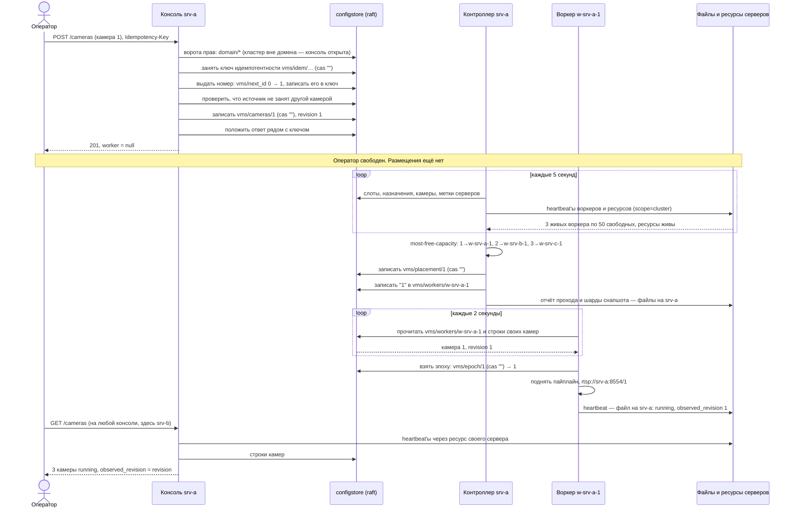

# Часть 6. Подтверждение: как оператор убеждается, что всё встало

> [!note] Записки поверх репозитория, а не его документация
> Это разбор: я читал код и восстанавливал по нему, как всё устроено, максимально простыми словами.
> **Источник истины — код.** Где записки расходятся с кодом, прав код.
> Проект описывает себя сам: [`README.md`](../../README.md) и указатели модулей.
> Состояние: коммит `6fd86b5`, 4 октября 2026.

[← карта разбора](README.md) · назад: [05-workers-and-epochs.md](05-workers-and-epochs.md) · вперёд: [07-edit-and-delete.md](07-edit-and-delete.md)


Три разных вопроса — три разных ответа, и источники у них разные.

Все запросы этой части — из трассы `06-operator-confirms.txt`. Камеры создавали на консоли `srv-a` (часть 3), а смотрит оператор через консоль `srv-b`: консоль стоит на каждом сервере (`vms-console.service`), и все они читают одно хранилище. Консоль ходит в него через сокет своей роли, `/run/configstore/console.sock`, а за объектами — к ресурсу своего сервера, `http://srv-b:8090`.

## 6.1. «Покажи мне все камеры» — `GET /cameras`

Консоль отвечает из **двух** источников сразу, и это принципиально:

```
# operator anna's browser → console on srv-b, http://srv-b:8080
GET /cameras
```

```json
{
  "rows": [
    {
      "id": 1,
      "ref": "",
      "name": "Ворота",
      "enabled": true,
      "phase": "running",
      "position": "converged",
      "revision": 1,
      "observed_revision": 1,
      "epoch": 1,
      "live_url": "rtsp://srv-a:8554/1",
      "live_shm": "shm:///run/vms/1.shm",
      "worker": "w-srv-a-1",
      "server": "srv-a",
      "age": 0.0,
      "worker_state": "live"
    },
    {"id": 2, "name": "Парковка", …, "live_url": "rtsp://srv-b:8554/2", "worker": "w-srv-b-1", "server": "srv-b", "age": 0.0, "worker_state": "live"},
    {"id": 3, "name": "Склад", …, "live_url": "rtsp://srv-c:8554/3", "worker": "w-srv-c-1", "server": "srv-c", "age": 0.0, "worker_state": "live"}
  ],
  "configured": [
    {
      "id": 1,
      "name": "Ворота",
      "source": "driverpack://acme/10.2.0.11",
      "enabled": true,
      "events_retention_days": null,
      "alarms_retention_days": null,
      "priority": 100,
      "labels": ["vlan:cctv"],
      "folders": [],
      "alarms": null,
      "ref": "",
      "cred_username": "",
      "cred_secret": "",
      "live": "always",
      "kind": "video",
      "revision": 1
    },
    {"id": 2, "name": "Парковка", "source": "driverpack://acme/10.2.0.12", …},
    {"id": 3, "name": "Склад", "source": "driverpack://acme/10.2.0.13", …}
  ]
}
```

`configured` — из строк камер, это **желаемое**. Им заполняются формы редактирования. `null` у сроков хранения и у тревог значит «не задано, наследуется» (раздел [4.5](04-placement.md)). `cred_secret` консоль на любом выходе маскирует; здесь он пустой, потому что пароля не задавали.

`rows` — из heartbeat'ов воркеров, это **фактическое**. Отсюда берутся `phase`, `epoch`, `observed_revision` и возраст отчёта. `age: 0.0` — особенность стенда: его часы стоят, и heartbeat «написан только что». В жизни здесь от нуля до десяти секунд — период heartbeat'а.

Смешивать их в один список нельзя, и причина простая: если сложить статус в хранилище настроек, получится кэш, который врёт — зелёная строчка в консоли над коробкой, которая ничего не пишет.

Что консоль ради этого прочла:

```
# фактическое — объекты, через ресурс srv-b; дёшево, зависит от числа воркеров, а не камер
# console on srv-b → the resource on srv-b, http://srv-b:8090
GET /v1/objects?prefix=vms/heartbeats/&scope=cluster
→ 200 {
  "server": "srv-b",
  "objects": {
    "vms/heartbeats/w-srv-b-1": {"written": 1757500000.0, "server": "srv-b", "size": 748},
    "vms/heartbeats/w-srv-a-1": {"written": 1757500000.0, "server": "srv-a", "size": 736},
    "vms/heartbeats/w-srv-c-1": {"written": 1757500000.0, "server": "srv-c", "size": 730}
  }
}
GET /v1/objects/vms/heartbeats/w-srv-a-1?scope=cluster
→ 200 {"bytes": 736, "X-Written": "1757500000.0", "X-Server": "srv-a"}
GET /v1/objects/vms/heartbeats/w-srv-b-1?scope=cluster   → 748 байт, X-Server: srv-b
GET /v1/objects/vms/heartbeats/w-srv-c-1?scope=cluster   → 730 байт, X-Server: srv-c

# желаемое — хранилище; дорого, по чтению на камеру
# console on srv-b → /run/configstore/console.sock
GET /v1/list?prefix=vms/cameras/
→ 200 {"keys": {"vms/cameras/1": 1008, "vms/cameras/2": 1010, "vms/cameras/3": 1012}}
GET /v1/get?key=vms/cameras/1     → строка «Ворота», index 1008
GET /v1/get?key=vms/cameras/2     → строка «Парковка», index 1010
GET /v1/get?key=vms/cameras/3     → строка «Склад», index 1012

# … и 18 чтений domain/* (ворота прав) — в трассе опущены
```

Heartbeat'ы лежат файлами на трёх разных серверах (часть [5.4](05-workers-and-epochs.md)), а консоль спрашивает только ресурс **своего** сервера, с `scope=cluster`. Ресурс `srv-b` сам опрашивает ресурсы `srv-a` и `srv-c` и отдаёт по каждому ключу самую свежую копию; `X-Server` говорит, с какого сервера она пришла (`cluster/objectstore.py`, урок М11 [6](../../М11_ClusterVMS/06-what-stays-on-the-server.md)).

Ворота прав (`Gate` в `w2cplatform/access.py`) стоят перед каждым маршрутом консоли, кроме страницы, `/metrics`, `/healthz` и входа (`OPEN_ROUTES`). Права раздаёт домен — служба платформы (М12), и консоль сначала выясняет, состоит ли кластер в домене: есть ли в хранилище набор ключей `domain/keys`. Если ключей нет, она проверяет пять отметок, которые пишет только агент домена (`domain/member`, `root`, `grants`, `revoked`, `break_glass`). Найдётся хоть одна — значит, кластер в домене был и ключи потерял, и тогда консоль закрыта для всех (`503`), а не открыта. Наш кластер ни в какой домен не входит: ключей нет, отметок нет, консоль **открыта**. Кто до неё дотянулся, тот администратор под любым именем, и консоль один раз пишет об этом в лог. Шесть чтений повторяются трижды: «пускать ли», «кто звонит» и фильтр списка по правам того, кто спросил. В кластере домена набор ключей находится первым же чтением, и дальше токен проверяет реализация М12 — что читает она, в этот сценарий не входит.

Итого `GET /cameras` — 22 чтения хранилища (18 у ворот и 4 по делу) и 4 запроса объектов. На трёх камерах разницы между половинами не видно. На шестистах камерах при двенадцати воркерах желаемое стоит 601 чтение хранилища, фактическое — 13 запросов объектов, а ворота — те же 18.

## 6.2. «Где камера 1 и почему» — `GET /where/1`

```
GET /where/1
→ 200 {
  "worker": "w-srv-a-1",
  "reason": "most free capacity (50) among 3 worker(s) reaching vlan:cctv; on srv-a, whose resource is live",
  "directory": "w-srv-a-1",
  "scans": 1
}
```

За этим ответом стоят два источника — и, как перед любым маршрутом, ворота. Всё здесь — хранилище, объектов нет:

```
# ворота: шесть чтений domain/*, как в разделе 6.1
GET /v1/get?key=vms/cameras/1          → метки камеры: права даются на камеру и на её метки
# ещё шесть чтений domain/*

# решение контроллера
GET /v1/get?key=vms/placement/1
→ 200 {
  "items": {
    "worker": "w-srv-a-1",
    "reason": "most free capacity (50) among 3 worker(s) reaching vlan:cctv; on srv-a, whose resource is live",
    "at": "1757500000.0",
    "rev": "1"
  },
  "index": 1013
}

# кто камеру реально ведёт: все назначения подряд
GET /v1/list?prefix=vms/workers/
→ 200 {"keys": {"vms/workers/w-srv-a-1": 1014, "vms/workers/w-srv-b-1": 1016, "vms/workers/w-srv-c-1": 1018}}
GET /v1/get?key=vms/workers/w-srv-a-1  → {"units": "1", "rev": "1"}
GET /v1/get?key=vms/workers/w-srv-b-1  → {"units": "2", "rev": "1"}
GET /v1/get?key=vms/workers/w-srv-c-1  → {"units": "3", "rev": "1"}
```

Итого 18 чтений: 12 у ворот и 6 по делу. Скан назначений консоль держит пять секунд (`directory` в `w2cplatform/console.py`): следующий `/where` в эти пять секунд обойдётся без четырёх последних чтений. Поле `scans` в ответе — сколько раз скан делался с запуска консоли.

Здесь сверяются два независимых ответа на один вопрос.

`worker` — из строки размещения: **решение контроллера**.

`directory` — из назначений: **кто эту камеру реально ведёт**, полученное сканированием всех строк `vms/workers/*`.

В норме они совпадают. Если в `directory` окажется `"w-srv-a-1+w-srv-b-1"`, значит камера числится за двумя воркерами сразу — такое видно в окне переназначения и не должно застревать надолго.

`reason` — та самая причина, собранная при размещении. По ней видно и сколько было свободной ёмкости, и сколько воркеров рассматривалось, и что ресурс сервера в тот момент отвечал.

## 6.3. «Что с кластером в целом» — `GET /metrics`

```
GET /metrics
→ 200 {"Content-Type": "text/plain", "bytes": 11606}
```

Страница — 11,6 КБ. Ниже её начало целиком и по строке-две из каждой следующей группы:

```
# TYPE vms_workers_live gauge
vms_workers_live 3
# TYPE vms_worker_headroom gauge
vms_worker_headroom{worker="w-srv-a-1",server="srv-a"} 49
vms_worker_headroom{worker="w-srv-b-1",server="srv-b"} 49
vms_worker_headroom{worker="w-srv-c-1",server="srv-c"} 49
vms_headroom 147
# TYPE vms_worker_load gauge
vms_worker_load{worker="w-srv-a-1"} 0.020
vms_worker_load{worker="w-srv-b-1"} 0.020
vms_worker_load{worker="w-srv-c-1"} 0.020
# TYPE vms_spare_workers gauge
vms_spare_workers 0
# TYPE vms_epoch_conflicts counter
vms_epoch_conflicts{worker="w-srv-a-1"} 0
vms_epoch_conflicts{worker="w-srv-b-1"} 0
vms_epoch_conflicts{worker="w-srv-c-1"} 0
# TYPE vms_failover_seconds gauge
vms_failover_seconds{kind="worst"} 0.0
# TYPE vms_failovers_unmeasured gauge
vms_failovers_unmeasured 0
# TYPE vms_heartbeats_garbled counter
vms_heartbeats_garbled 0
# TYPE vms_heartbeat_skew_seconds_max gauge
vms_heartbeat_skew_seconds_max 0.0
# TYPE vms_heartbeat_skew_seconds_min gauge
vms_heartbeat_skew_seconds_min 0.0
# TYPE vms_cameras_running gauge
vms_cameras_running 3
# TYPE vms_snapshot_age_seconds gauge
vms_snapshot_age_seconds 0.0
# TYPE vms_reconcile_last_pass_age_seconds gauge
vms_reconcile_last_pass_age_seconds 0.0
# TYPE vms_reconcile_last_success_age_seconds gauge
vms_reconcile_last_success_age_seconds 0.0
# TYPE vms_reconcile_pass_seconds gauge
vms_reconcile_pass_seconds 0.004
# TYPE vms_reconcile_failures counter
vms_reconcile_failures 0
# TYPE vms_units_unplaced gauge
vms_units_unplaced 0
# TYPE vms_units_diverged gauge
vms_units_diverged 0
…
# TYPE vms_workers_hung gauge
vms_workers_hung 0
…
# TYPE vms_rows_garbled gauge
vms_rows_garbled 0
# TYPE vms_worker_fenced gauge
vms_worker_fenced{worker="w-srv-a-1"} 0
…
# TYPE vms_worker_store_errors counter
vms_worker_store_errors{worker="w-srv-a-1"} 0
…
# TYPE vms_worker_unconfirmed gauge
vms_worker_unconfirmed{worker="w-srv-a-1"} 0
…
# TYPE vms_worker_pass_failures counter
vms_worker_pass_failures{worker="w-srv-a-1"} 0
…
# TYPE vms_worker_slots_garbled counter
vms_worker_slots_garbled{worker="w-srv-a-1"} 0
…
# TYPE vms_console_rows_garbled counter
vms_console_rows_garbled{table="assignment"} 0
…
# TYPE vms_workers_needed gauge
vms_workers_needed{labels=""} 0
vms_workers_needed{labels="vlan:cctv"} 0
# TYPE vms_units_short gauge
vms_units_short{labels=""} 0
vms_units_short{labels="vlan:cctv"} 0
# TYPE vms_spare_offers gauge
vms_spare_offers{labels=""} 0
vms_spare_offers{labels="vlan:cctv"} 0
# TYPE vms_server_labels gauge
vms_server_labels{server="srv-a",labels="vlan:cctv",source="node"} 1
vms_server_labels{server="srv-b",labels="vlan:cctv",source="node"} 1
vms_server_labels{server="srv-c",labels="vlan:cctv",source="node"} 1
# TYPE w2c_resources_live gauge
w2c_resources_live 3
# TYPE w2c_resource_heartbeats_garbled counter
w2c_resource_heartbeats_garbled 0
# TYPE w2c_resource_full gauge
w2c_resource_full{server="srv-a"} 0.25
w2c_resource_full{server="srv-b"} 0.25
w2c_resource_full{server="srv-c"} 0.25
# TYPE w2c_resource_short_bytes gauge
w2c_resource_short_bytes{server="srv-a"} 0
…
# TYPE w2c_resource_waits gauge
w2c_resource_waits{server="srv-a"} 0
…
# TYPE w2c_resource_restore_left gauge
w2c_resource_restore_left{server="srv-a"} -1
…
# TYPE w2c_resource_mirror_failures_total counter
w2c_resource_mirror_failures_total{server="srv-a"} 0
…
```

Группы такие. Воркеры и их ёмкость (`vms_workers_live` … `vms_cameras_running`). Проход контроллера — из его отчёта (`vms_reconcile_*`, `vms_units_*`, списания и зависшие воркеры, `vms_rows_garbled`). Здоровье каждого воркера — те поля его heartbeat'а, которые размещение не читает (`vms_worker_fenced`, `vms_worker_store_errors`, `vms_worker_unconfirmed`, `vms_worker_pass_failures`). Строки хранилища, которые не удалось разобрать: у воркеров по таблицам (`vms_worker_*_garbled`, по строке на воркер и таблицу — их больше двадцати) и у самой консоли (`vms_console_rows_garbled{table=…}`). Недостача ёмкости по наборам меток — то, что читает скрипт запасных (`vms_units_short`, `vms_workers_needed`, `vms_spare_offers`). Метки серверов (`vms_server_labels`). И ресурсы серверов — диск, ожидания, восстановление, зеркало событий (`w2c_resource_*`; это метрики платформы, у них префикс `w2c_`, а не `vms_`). В нашем сценарии все счётчики — нули.

За этой страницей 8 чтений хранилища и 57 запросов объектов. Ворот нет: `/metrics` — один из открытых маршрутов, его читает мониторинг. Из хранилища — только метки серверов, дважды: листинг `vms/servers/` (пустой — строк меток из консоли никто не заводил) и `vms/servers/srv-a`, `srv-b`, `srv-c` поштучно (`{"items": null}`); имена серверов консоль берёт из heartbeat'ов. Остальное — объекты через ресурс `srv-b`:

| Что | Сколько раз | Запросов |
|---|---|---|
| heartbeat'ы воркеров: листинг `vms/heartbeats/` и три объекта | 11 — по разу на каждую группу строк, которой они нужны | 44 |
| heartbeat'ы ресурсов: листинг `platform/resources/` и три объекта | 2 | 8 |
| шарды снапшота: листинг `vms/snapshot/` и три шарда (за их возрастом) | 1 | 4 |
| отчёт прохода `vms/controller/pass` | 1 | 1 |

На стенде объектные листинги не кэшируются (`list_fresh=0` в `tests/conftest.py`). В юните консоли листинг живёт секунду (`LIST_FRESH = 1.0` в `cluster/objectstore.py`), поэтому из одиннадцати листингов heartbeat'ов останется один и из двух листингов ресурсов — один; чтения самих объектов останутся как есть.

`vms_cameras_running 3` — это счёт записей в фазе `running` по живым воркерам, то есть тот же источник, что и `rows`.

`vms_reconcile_last_pass_age_seconds 0.0` — отчёт о проходе есть, и он свежий. Отчёт пишет `pass_once` контроллера файлом `vms/controller/pass` на своём сервере (в трассе — 607 байт, `X-Server: srv-a`); консоль читает его через свой ресурс. Юнит контроллера М11 гоняет тот же проход, что на коробке: `_placement_pass` в `cluster/__main__.py` зовёт `pass_once(1)` и затем `publish_snapshot`, каждый шаг в своём `try` (урок М11 [10](../../М11_ClusterVMS/10-the-controller.md)). Поэтому `vms_reconcile_*`, `vms_units_unplaced`, `vms_units_diverged` и `vms_rows_garbled` в кластере говорят правду. Значение `-1` у возрастов означало бы «отчёта нет» — проход ни разу не прошёл.

`vms_spare_workers 0` — метрика общая для всех подсистем. Она считает живых воркеров, которые не держат никакого места (`place_of` пуст). Места бывают у записи — это тома архива. У VMS место — это сервер воркера, и пустым оно не бывает, поэтому здесь всегда `0`. Запасные VMS устроены иначе: запасной, запущенный скриптом с `SPARE_FOR=…`, ждёт предложения слота и, пока не взял его, никто — heartbeat'а не пишет. Его видно по `vms_spare_offers` (раздел [8.8](08-failures.md)). В `vms_worker_load` воркер без места не попадает: его нулевая загрузка тянула бы среднее вниз.

`vms_failover_seconds{kind="worst"}` — самое долгое переключение, какое эта консоль измерила с запуска. Меряет его `failover_seconds` контроллера на каждом опросе страницы, по heartbeat'ам: если прежний экземпляр имени работал на том же сервере (`previous_server`), — разница между его последним heartbeat'ом (`previous_hb`) и стартом нового (`started`), на часах одного сервера; если на другом — по часам самой консоли: от того, когда она в последний раз видела, что heartbeat прежнего экземпляра обновился, до того, как увидела под этим именем новый экземпляр. Число, которое нельзя получить на одних часах, не выдумывается, а считается в `vms_failovers_unmeasured`. По каждому воркеру с измеренным переключением появляется строка `kind="last"`; здесь переключений не было, и строк нет.

`vms_snapshot_age_seconds` показывает, насколько устарела копия, которую читает слой над кластером: возраст самого старого шарда. На стенде часы стоят, отсюда `0.0`. По шкале сценария (раздел 6.6) шарды записаны в `T+3.7`, страница открыта в `T+12.0` — в жизни здесь было бы около 8 секунд. Значение `-1` означало бы «снапшот не публиковался ни разу» — отдельный случай от «опубликован только что».

`vms_heartbeat_skew_seconds_*` — насколько часы heartbeat'ов расходятся с часами читателя, с запуска процесса. Максимум показывает, насколько heartbeat оказывался **впереди**: heartbeat из будущего дальше чем на 5 секунд живым не считается. Минимум показывает самый старый heartbeat, который ещё признали живым. На здоровом кластере это период heartbeat'а плюс задержка, около −10 секунд. Если чьи-то часы отстают, минимум ползёт к −45 (`is_live` в `w2cplatform/contract.py`). На стенде оба — `0.0`: его часы не идут.

`vms_server_labels{…,source="node"}` — откуда контроллер взял метки сервера: `node` — из `LABELS` в heartbeat'е воркера этого сервера, потому что строки `vms/servers/<srv>` из консоли нет (раздел [4.1](04-placement.md)).

## 6.4. Что видит слой над кластером

Домен строк камер не читает: они принадлежат кластеру, и веер поштучных чтений через глобальную сеть был бы и медленным, и нарушением правила одного писателя. Он читает шарды снапшота — объекты, которые контроллер публикует после каждого прохода. Как и heartbeat'ы, это **файлы**: каждый контроллер пишет их на диск своего сервера, `/data/platform/objects/vms/snapshot/<воркер>`. Контроллер стоит на каждом сервере, поэтому копий снапшота на дисках может быть несколько, и читатель берёт самую свежую по `written`. Так их видит консоль `srv-b`, когда считает `vms_snapshot_age_seconds`:

```
GET /v1/objects?prefix=vms/snapshot/&scope=cluster
→ 200 {
  "server": "srv-b",
  "objects": {
    "vms/snapshot/w-srv-a-1": {"written": 1757500000.0, "server": "srv-a", "size": 389},
    "vms/snapshot/w-srv-b-1": {"written": 1757500000.0, "server": "srv-a", "size": 401},
    "vms/snapshot/w-srv-c-1": {"written": 1757500000.0, "server": "srv-a", "size": 383}
  }
}
GET /v1/objects/vms/snapshot/w-srv-a-1?scope=cluster   → 389 байт, X-Server: srv-a — шард с камерой 1
GET /v1/objects/vms/snapshot/w-srv-b-1?scope=cluster   → 401 байт, X-Server: srv-a — шард с камерой 2
GET /v1/objects/vms/snapshot/w-srv-c-1?scope=cluster   → 383 байт, X-Server: srv-a — шард с камерой 3
```

Все три шарда лежат на `srv-a`: проход в сценарии делал контроллер `srv-a`. В шарде — кластер, воркер, `ts` прохода и камеры этого воркера с сервером, без учётных данных (содержимое — в разделе [4.5](04-placement.md)).

В нашем сценарии шардов было бы четыре, а не три: пустой `unplaced` остался с прохода по пустому кластеру (раздел [2.5](02-before-first-camera.md)) и переписывается пустым на каждом проходе (`_publish_snapshot` в `w2cplatform/spec.py` переписывает каждый шард, который уже есть). В трассе `06` его нет: стенд этой сцены сразу создал камеры, без прохода по пустому кластеру, а пустой `unplaced` пишется, только когда публиковать больше нечего.

Возрастом всей картины домен считает **самый старый** шард, а не самый свежий: каталог свеж настолько, насколько свежа его отставшая часть.

## 6.5. Что считать подтверждением

Три признака, и все три нужны:

| Признак | Где смотреть | Что означает |
|---|---|---|
| `vms/placement/<id>` существует и `worker` непустой | `GET /where/<id>` | контроллер решил, где камере работать |
| `phase: running` | `rows` в `GET /cameras` | воркер поднял пайплайн |
| `observed_revision == revision` | `rows` в `GET /cameras` | поднял именно на той конфигурации, что задана |

Четвёртый, необязательный, но полезный: `epoch` в статусе не равен нулю — воркер взял право писать эту камеру. И `worker_state: live` рядом — heartbeat этого воркера моложе 45 секунд (`lost_after`), то есть статус не прошлогодний.

---

## 6.6. Вся временная шкала одним куском

Отметки `T+…` условные: стенд, с которого сняты трассы, гоняет шаги один за другим на остановленных часах. Порядок событий — по трассам `02`–`06`.

| Время | Кто | Что сделал | Записал в хранилище | Записал файлом на своём сервере |
|---|---|---|---|---|
| до сценария | ресурсы | рассказали о своих дверях | `platform/doors/srv-a..c` | — |
| до сценария | воркеры | взяли слоты, `cas: ""` | `vms/slots/w-srv-a-1`, `…-b-1`, `…-c-1` | — |
| до сценария | воркеры | первый heartbeat, `status: []` | — | `vms/heartbeats/w-srv-X-1` (484 байта), каждый на своём |
| до сценария | ресурсы | отчитались о дисках | — | `platform/resources/srv-X/heartbeat`, каждый на своём |
| до сценария | контроллер `srv-a` | прошёл по пустому кластеру | ничего | `vms/controller/pass`, `vms/snapshot/unplaced` (пустой) |
| `T+0.0` | консоль `srv-a` | создала камеру 1 | `vms/idem/k-anna-0001` (pending, `cas: ""`), `vms/next_id` = 1, `idem` с номером, `vms/cameras/1` (`cas: ""`), `idem` с ответом | — |
| `T+1.2` | консоль `srv-a` | создала камеру 2 | те же ключи, номер 2 | — |
| `T+2.0` | консоль `srv-a` | создала камеру 3 | те же ключи, номер 3 | — |
| `T+3.4` | контроллер `srv-a` | разместил все три | `vms/placement/1..3`, `vms/workers/w-srv-a-1`, `…-b-1`, `…-c-1` (6 записей) | `vms/controller/pass` |
| `T+3.7` | контроллер `srv-a` | опубликовал снапшот | — | `vms/snapshot/w-srv-a-1`, `…-b-1`, `…-c-1`, `unplaced` |
| `T+4.1` | w-srv-a-1 | прочитал назначение и строку, взял эпоху, поднял поток | `vms/epoch/1` (`cas: ""`) | — |
| `T+4.6` | w-srv-b-1 | то же со своей камерой | `vms/epoch/2` | — |
| `T+5.0` | w-srv-c-1 | то же со своей камерой | `vms/epoch/3` | — |
| `T+10.3` | w-srv-a-1, b-1, c-1 | heartbeat с `phase: running` | — | `vms/heartbeats/w-srv-X-1` (~740 байт), каждый на своём |
| `T+11.9` | w-srv-a-1 | шаг аренд: продлил слот, перечитал эпоху | `vms/slots/w-srv-a-1` (по CAS) | — |
| `T+12.0` | оператор | на консоли `srv-b` увидел три работающие камеры | — | — |

Шаг аренд у каждого воркера идёт своим ходом, раз в ~8,3 секунды, и в таблице показан один — тот, что есть в трассе `05`. Столбец «файлом» — главное отличие от стенда на Nomad: всё, что пишется каждые несколько секунд и имеет одного писателя, в raft не попадает.

**Сколько ждать в худшем случае.** Складываются четыре независимых интервала, и каждый взят из кода:

| Ожидание | Сколько | Откуда число |
|---|---|---|
| контроллер проснётся | до 5 с | `stop.wait(5)` в цикле `controller()` в `cluster/__main__.py` |
| воркер проснётся | до 2 с | `poll = 2.0` в `VmsWorker.run` |
| воркер отчитается | до 10 с | heartbeat раз в 10 с, там же |
| страница опросит консоль | до 10 с | `setInterval(…, 10000)` в `w2cplatform/console.html` |
| **итого до «зелёного» на экране** | **до 27 с** | сумма четырёх |

Сверху может добавиться секунда: консоль держит листинг heartbeat'ов секунду (`LIST_FRESH`). Самой доставки файла ждать не нужно — консоль читает его с сервера воркера через ресурсы в момент запроса. Типично получается около 10–14 секунд. Важно понимать, что из 27 секунд лишь 7 — это реальная задержка до запуска видео; остальные 20 уходят на то, чтобы факт дошёл до экрана.

### Сценарий: от создания камеры до подтверждения



---

[← карта разбора](README.md) · назад: [05-workers-and-epochs.md](05-workers-and-epochs.md) · вперёд: [07-edit-and-delete.md](07-edit-and-delete.md)
