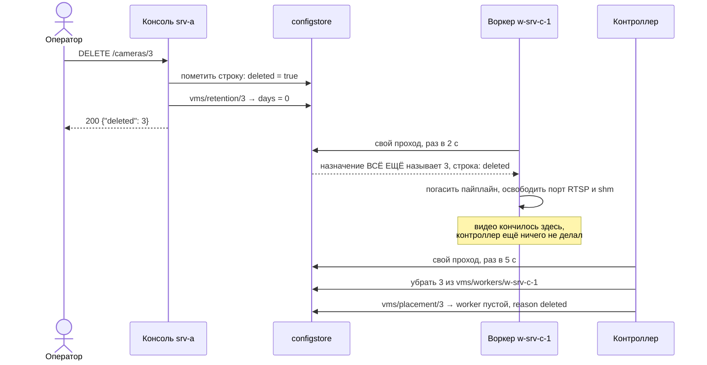

# Часть 7. Оператор правит и удаляет камеру

> [!note] Записки поверх репозитория, а не его документация
> Это разбор: я читал код и восстанавливал по нему, как всё устроено, максимально простыми словами.
> **Источник истины — код.** Где записки расходятся с кодом, прав код.
> Проект описывает себя сам: [`README.md`](../../README.md) и указатели модулей.
> Состояние: коммит `970e5a7`, 4 октября 2026.

[← карта разбора](README.md) · назад: [06-confirmation.md](06-confirmation.md) · вперёд: [08-failures.md](08-failures.md)

Тот же кластер после [части 6](06-confirmation.md): три камеры работают, камера 2 «Парковка» лежит на `w-srv-b-1`, камера 3 «Склад» — на `w-srv-c-1`. Оператор `anna` через консоль на `srv-a` правит камере 2 срок хранения событий, а потом удаляет камеру 3 совсем. Создание разобрано в [части 3](03-creating-a-camera.md), размещение — в [части 4](04-placement.md).

Обе операции устроены по одному правилу: **консоль пишет только то, чем владеет, и никому ничего не сообщает.** Всё остальное делают воркер и контроллер, когда сами придут читать.

---

## 7.1. Правка: один запрос оператора — четыре записи

```
PUT /cameras/2
Idempotency-Key: k-anna-0004

{"events_retention_days": 30}
```

Консоль ходит в хранилище через свой сокет `/run/configstore/console.sock` двадцать шесть раз. Двенадцать чтений `domain/*` и пять чтений строки камеры — ворота прав, девять запросов — работа, и записей среди них четыре:

```
# ворота: двенадцать чтений domain/* (шесть ключей, дважды — раздел 6.1)
GET /v1/get?key=vms/cameras/2   ×5                    строка как она есть и как будет после правки
                                                      → revision "1", index 1010

# работа
POST /v1/write {"op": "put", "key": "vms/idem/k-anna-0004", "cas": "",
                "items": {"state": "pending", "sub": "anna", "sha256": "5a0b53…", "at": …}}
                                                      → 1022   1. занять ключ идемпотентности
GET  /v1/list?prefix=vms/idem/                        → {"vms/idem/k-anna-0004": 1022}
GET  /v1/get?key=vms/idem/k-anna-0004                 чистка старых ключей мимоходом
GET  /v1/get?key=vms/cameras/2                        → index 1010
POST /v1/write {"op": "put", "key": "vms/cameras/2", "cas": 1010,
                "items": {…, "revision": "2", "events_retention_days": "30", …}}
                                                      → 1023   2. строка камеры
GET  /v1/get?key=vms/retention/2                      → {"items": null, "index": ""}
POST /v1/write {"op": "put", "key": "vms/retention/2", "cas": "", "items": {"days": "30"}}
                                                      → 1024   3. производная строка
GET  /v1/get?key=vms/alarms_retention/2               → {"items": null, "index": ""}
POST /v1/write {"op": "put", "key": "vms/idem/k-anna-0004", "cas": 1022,
                "items": {"state": "done", "status": "200", "body": "{…}", …}}
                                                      → 1025   4. ответ рядом с ключом
```

Пять чтений строки перед работой — ворота спрашивают о камере в два приёма (`dispatch` и `admit_cams` в `w2cplatform/console.py`): до тела запроса — по строке как она есть, после тела — по строке как она будет. Правка может задеть не только свою камеру: смена `source` переводит камеру на канал другого прибора, а это дело всех камер того прибора. Поэтому консоль спрашивает права на каждую камеру, которую правка задевает. Здесь такая камера одна, сама вторая, и в открытом кластере ответ всегда «да». Ворота разобраны в разделе [6.1](06-confirmation.md). В кластере домена чтений ворот будет другое число — их считает реализация прав М12.

Отвечает `200` с новой строкой и `revision: 2`:

```
→ 200 {"id": 2, "name": "Парковка", "source": "driverpack://acme/10.2.0.12", "enabled": true,
       "events_retention_days": 30, "alarms_retention_days": null, "labels": ["vlan:cctv"], …, "revision": 2}
```

Поля `worker` в ответе **нет**: размещение лежит в другом ключе, `vms/placement/2`, и консоль его не касается.

Четыре записи — это при двух условиях: клиент прислал `Idempotency-Key` (для `PUT` он необязателен) и правленое поле питает производную строку. Правка имени стоит двух записей меньше: без ключа идемпотентности — одна запись, только строка камеры. Производные строки освежаются вместе, когда меняется любое их исходное поле: консоль прочитала и `vms/alarms_retention/2`, но писать туда нечего — срок тревог не задан, а записывается строка, только если она отличается от того, что в ней лежит (`_derived` в `w2cplatform/spec.py`). Список и чтение старых ключей `vms/idem/` бывают не на каждом запросе: чистка идёт не чаще раза в минуту на консоль (`IdempotencyKeys` в `w2cplatform/console.py`).

**Почему шага два, а не один.** Строка хранилища пишется целиком — обновить одно поле нельзя. Нужно прочитать строку, подменить поле и записать обратно, а `"cas": 1010` защищает от гонки: если кто-то правил ту же камеру между чтением и записью, хранилище ответит `409 {"kind": "conflict", …}`, и цикл повторится с новым `index`, до десяти попыток, со случайной растущей паузой между ними (`write` в `w2cplatform/contract.py`). Тот же механизм на примере двух операторов — в разделе [8.2](08-failures.md).

**Почему ключ идемпотентности, а не ничего.** Повтор запроса может попасть на консоль **другого сервера**. Та увидит занятый ключ, дождётся готового ответа первой и отдаст его, не повторяя запись. Поэтому состояние повторов тоже лежит в хранилище: иначе две консоли о нём бы не знали. В ключе записаны и тот, кто спросил (`sub`), и хеш тела (`sha256`): тот же ключ от другого человека или с другим телом — `422`, а не чужой ответ. Ответ кладётся по CAS на `index` захвата (`"cas": 1022`): если захват за это время перехватила другая консоль, ответ не затрёт её. Что видит повтор, пришедший в промежутке, разобрано в разделе [8.1](08-failures.md).

### Все настройки камеры — в одной строке хранилища

```
vms/cameras/2 → {"id": "2", "revision": "2", "name": "Парковка",
                 "source": "driverpack://acme/10.2.0.12", "enabled": "true",
                 "events_retention_days": "30", "labels": "vlan:cctv", …}
```

Одна строка — это один ключ `configstore`, одна запись по CAS и один `index`, поэтому воркер видит либо все настройки старыми, либо все новыми. Разложите их по пяти ключам, и появится состояние «половина применилась».

Строка небольшая: в нашем кластере у камеры 255 байт полей и 356 байт тела записи ([часть 10](10-limits-and-scale.md)). Потолка размера строки у `configstore` нет: демон принимает строку любого размера, а потолок, если он нужен, объявляет адрес хранилища — `configstore:///run/configstore/<роль>.sock?max_bytes=n` (`w2cplatform/configstorevars.py`, `w2cplatform/limits.py`). Юниты курса его не объявляют (`PLATFORM_STORE=configstore:///run/configstore/console.sock`), значит `max_bytes = 0` — потолка нет. Если объявить, правка, которая не влезает, получит у консоли `413` с размером и пределом, до всякой записи. Что ограничено и без объявления: тело запроса к консоли — мебибайт (`MAX_BODY`, `CONSOLE_MAX_BODY` в `w2cplatform/console.py`), а имя ключа — 246 байт в закодированном виде (`KEY_BYTES` в `w2cplatform/variables.py`). Старые 64 КиБ были потолком Variables Nomad и ушли вместе с ними. Почему строки при этом держат маленькими: каждая запись строки целиком идёт через журнал raft на все серверы (урок М11 [2](../../М11_ClusterVMS/02-the-store-becomes-replicated.md)).

Ключ делят только когда у настройки **другой читатель**. Таких случаев два: срок хранения событий дублируется в `vms/retention/<id>`, а срок хранения тревог — в `vms/alarms_retention/<id>`. Оба читает ресурс, которому камера целиком не нужна. Пока срок не задан, производной строки нет вовсе — как у камеры 2 до этой правки, где консоль получила `{"items": null}` и создала строку с `"cas": ""`. Ресурс идёт по цепочке: строка камеры, иначе общая строка подсистемы (`vms/retention` или `vms/alarms_retention`), иначе год (для тревог — три года; `retention_days` в `w2cplatform/resource.py`).

### Что значит «применилось»

Запросов к воркеру никто не делает. Воркер раз в две секунды (`run(poll=2.0)` в `vms/worker.py`) читает сам — тем же проходом, что разобран в разделе [5.1](05-workers-and-epochs.md):

```
# vmsworker w-srv-b-1 on srv-b → /run/configstore/vmsworker.sock
GET /v1/get?key=vms/workers/w-srv-b-1   → {"units": "2", "rev": "1"}
GET /v1/get?key=vms/cameras/2           → revision "2", events_retention_days "30", index 1023

# vmsworker w-srv-b-1 on srv-b → its own files on srv-b
PUT vms/heartbeats/w-srv-b-1
```

Два чтения, ни одной записи в хранилище и файл heartbeat'а на своём сервере. Ревизия выросла — воркер перезапускает пайплайн с новой настройкой и пишет в heartbeat `observed_revision: 2`. Эпоха при этом остаётся прежней, `1`: правка — не новый держатель, и в `vms/epoch/2` никто не пишет. **Единственное определение «применено» — `observed_revision >= revision`.** Пока оно меньше, настройка задана, но ещё не подействовала.

Отсюда важное: **`200` уходит оператору до того, как настройка доехала до видео.** А срок хранения событий воркеру и вовсе не нужен — его прочтёт ресурс из `vms/retention/2` на своём следующем проходе политики.

### Чего консоль сделать не может

```
PUT /cameras/2  {"worker": "w-srv-a-1"}
→ 400 "a client may not set ['worker']: placement is decided and stored by the controller with a reason;
       revision, epoch and phase are not the operator's"
```

Поля `worker`, `placement`, `epoch`, `revision`, `observed_revision`, `phase` и `id` клиент не присылает никогда (`PLATFORM_FIELDS` и `refuse` в `w2cplatform/spec.py`). Первые два принадлежат контроллеру, `revision` и `id` — платформе, остальные воркеру. До строки камеры такой запрос не доходит, но ключ идемпотентности, если он прислан, занимает: отказ `400` кладётся под ключ, как любой ответ, и повтор с тем же ключом получит тот же отказ.

И дело не только в проверке консоли. Сокет `console.sock` пишет `vms/cameras/*`, `vms/next_id`, `vms/idem/*`, `vms/retention/*`, `vms/alarms_retention/*` и ещё несколько строк оператора, но не `vms/workers/*` и не `vms/placement/*` — их пишет только `vmscontroller.sock` (`М11_ClusterVMS/clustervms/deploy/configstore-rights.json`, урок М11 [5](../../М11_ClusterVMS/05-rights-by-who-is-calling.md)). Проскочи такое поле мимо `refuse`, хранилище всё равно не дало бы консоли записать назначение.

---

## 7.2. Удаление: поток гасит воркер, а не контроллер

Это главное и самое неочевидное. Консоль только ставит пометку, видео кончается на проходе воркера, а контроллер приходит потом и занимается одной бухгалтерией.



**Шаг 1. Консоль помечает строку — и всё.** Сначала те же ворота, что у правки (раздел 7.1): двенадцать чтений `domain/*` и пять чтений строки; удаление требует `admin` на камеру. Потом консоль проверяет, что камера есть и ещё не помечена (иначе `404`), и делает два read-modify-write по CAS. Работы — пять запросов, из них две записи:

```
# console on srv-a → /run/configstore/console.sock
GET  /v1/get?key=vms/cameras/3                        проверка: есть и не помечена
GET  /v1/get?key=vms/cameras/3                        чтение под CAS → index 1012
POST /v1/write {"op": "put", "key": "vms/cameras/3", "cas": 1012,
                "items": {…, "revision": "1", "deleted": "true"}}          → 1026
GET  /v1/get?key=vms/retention/3                      → {"items": null, "index": ""}: срок не задавали
POST /v1/write {"op": "put", "key": "vms/retention/3", "cas": "", "items": {"days": "0"}}  → 1027
```

Всего с воротами — двадцать два запроса. Ключа идемпотентности здесь нет: `DELETE` его не использует никогда. Повтор и так безопасен — вторая попытка упрётся в `404`, «gone is gone», и ничего не запишет. `revision` пометка не трогает: она остаётся `1`.

Строка не удаляется, а помечается:

```1248:1256:vmsserver/w2cplatform/spec.py
    # The operator's half: the row is marked `deleted: "true"` (not removed) and derived rows get their
    # `on_delete`. Its placement is the controller's half, taken back on the next pass by `unplace_deleted`
    # — a console's token cannot touch an assignment, and does not need to.
    def delete(self, uid) -> None:
        """The operator's half: the row is marked. Its placement is the controller's
        half, taken back on the next pass (`unplace_deleted`) — a console's token
        cannot touch an assignment, and does not need to."""
        self.write(self._row_key(uid), lambda it: {**it, "deleted": "true"} if it else None)
        self._derived(None, uid, deleted=True)
```

(«Token» в комментарии — слово с прежнего стенда; теперь это сокет роли `console`, и права у него те же: назначение ему не по силам.)

Вторая запись — производная строка `on_delete: {days: 0}` из спецификации, чтобы бакеты событий удалённой камеры ушли сами. Пишется она **и тогда, когда строки не было**, как здесь (`"cas": ""` — «только создать»). Раньше правило было «если строка есть», и оно перестало быть верным, когда срок научился наследоваться. У камеры, срок которой не задан и наследуется, производной строки нет вовсе, удаление не писало ничего, и события удалённой камеры жили по умолчанию подсистемы — год (обратная связь, пункт BO; `_derived` в `w2cplatform/spec.py`). У строки тревог `on_delete` нет, и консоль `vms/alarms_retention/3` даже не читает. Это ответ на вопрос «стирать ли тревоги при удалении камеры»: удаление кончает наблюдения, а не запись о том, что случилось. Тревоги доживают свой срок.

Назначение `vms/workers/w-srv-c-1` и размещение `vms/placement/3` консоль не трогала: её сокет на это не имеет права, что видно по таблице прав в [справочнике](01-reference.md).

Ответ `200 {"deleted": 3}`. С этого момента камера исчезла из всех списков, потому что `unit()` и `units()` фильтруют по `deleted != "true"`. Но воркер её ещё ведёт.

**Шаг 2. Воркер на следующем опросе — здесь гаснет поток.** Назначение всё ещё называет камеру 3, но её строка помечена, и воркер её пропускает:

```
# vmsworker w-srv-c-1 on srv-c → /run/configstore/vmsworker.sock
GET /v1/get?key=vms/workers/w-srv-c-1   → {"units": "3", "rev": "1"}      назначение прежнее
GET /v1/get?key=vms/cameras/3           → {…, "deleted": "true"}, index 1026

# vmsworker w-srv-c-1 on srv-c → its own files on srv-c
PUT vms/heartbeats/w-srv-c-1                                             работает: []
```

```647:650:vmsserver/vms/worker.py
        for unit in a.units:
            items, _ = self.vars.get(self.SUB.config(self.ROWS, unit))
            if items and items.get("deleted") != "true":
                try:
```

Камера не попала в желаемое состояние. Реконсилятор видит её в работающем и не видит в желаемом — гасит пайплайн, освобождает порт RTSP и shm, и из этого же heartbeat'а она исчезает (`headroom` у `w-srv-c-1` снова 50). В хранилище воркер не пишет ничего: два чтения, ноль записей. Строку `vms/epoch/3` он не трогает — она остаётся с `{epoch: 1}`.

**Шаг 3. Контроллер, не позже пяти секунд — только бухгалтерия.** Это первый шаг его прохода, `unplace_deleted` (раздел [4.1](04-placement.md)): по каждой строке `vms/placement/` он перечитывает строку камеры и на третьей видит пометку. Записей в проходе две, обе по CAS:

```
# vmscontroller on srv-a → /run/configstore/vmscontroller.sock
POST /v1/write {"op": "put", "key": "vms/workers/w-srv-c-1", "cas": 1018,
                "items": {"units": "", "rev": "2"}}                                    → 1028   ← сначала
POST /v1/write {"op": "put", "key": "vms/placement/3", "cas": 1017,
                "items": {"worker": "", "reason": "deleted", "at": …, "rev": "2"}}     → 1029   ← потом
```

Порядок не случайный. Обнулите размещение первым и упадите — **сироту больше не по чему найти**: назначение её всё ещё называет, а размещение уже ни на кого не указывает. Проход целиком — 27 чтений хранилища, 2 записи, 12 запросов объектов к ресурсам и 4 файла на `srv-a`: отчёт прохода и снапшот — тот самый шаг публикации из раздела [4.5](04-placement.md):

```
# vmscontroller on srv-a → its own files on srv-a
PUT vms/controller/pass
PUT vms/snapshot/w-srv-a-1
PUT vms/snapshot/w-srv-b-1
PUT vms/snapshot/w-srv-c-1     → {"cluster": "cluster-a", "worker": null, "ts": …, "cameras": []}
```

Третьей камеры в снапшоте больше нет. Шард `w-srv-c-1`, у которого не осталось камер, не удаляется, а переписывается пустым: публикация переписывает пустым любой шард, который есть, но который этот проход не заполнил (`publish_snapshot` в `w2cplatform/spec.py`). Если в кластере лежит и шард `unplaced` — в нашей истории он остался с прохода по пустому кластеру, раздел [2.5](02-before-first-camera.md), — он тоже переписывается пустым, и файлов будет пять. (Стенд, на котором снята трасса, прохода по пустому кластеру не делал, поэтому файлов в ней четыре.)

Следующий проход воркера видит уже пустое назначение — одно чтение, и никаких строк камер:

```
GET /v1/get?key=vms/workers/w-srv-c-1   → {"units": "", "rev": "2"}, index 1028
PUT vms/heartbeats/w-srv-c-1             (файл на srv-c)
```

### Что остаётся жить после удаления

| Что | Судьба |
|---|---|
| `vms/cameras/3` | **остаётся навсегда** с `deleted: "true"` |
| `vms/placement/3` | остаётся с пустым воркером и `reason: deleted` |
| `vms/workers/w-srv-c-1` | остаётся с пустым `units` — слот и воркер живы, камер просто нет |
| `vms/retention/3` | `{days: "0"}` |
| бакеты событий | уйдут на следующем проходе политики ресурса (раз в десять минут), по `{days: 0}` |
| тревоги | живут свой срок: строку `vms/alarms_retention/3` удаление не читает и не трогает |
| `vms/epoch/3` | остаётся с последним номером, `{epoch: 1}` — эту строку тоже никто не удаляет |
| шард снапшота `w-srv-c-1` | файл на `srv-a`, переписан пустым; удаляет объекты платформа никогда |
| видеоархив | если камеру записывали — принадлежит записи (подсистема `rec`) и лежит в её томе до срока хранения записи; удаление камеры его не трогает |
| номер 3 | **не переиспользуется** — `next_id` только растёт, а если строку счётчика не прочесть, следующий номер считается от наибольшего id среди строк, помеченные включая (`_next_id` в `w2cplatform/spec.py`) |

**Надгробия никто не убирает.** Удалять строки в системе умеют — ключи идемпотентности, исполненные заявки, строки меток серверов, заявки на списание, — а строку камеры не удаляет никто. Значит каждая когда-либо удалённая камера навсегда стоит двух ключей в raft — строки и размещения с пустым воркером — и нескольких `GET` на каждый проход контроллера: строку читает каждый обход `units()`, размещение — каждый обход `vms/placement/`. Обход платит не за живые камеры, а за все, что когда-либо были. На площадке с ротацией камер это со временем утяжеляет чтение — во что обходится проход контроллера на сотнях камер, посчитано в разделе [10.2](10-limits-and-scale.md).

Это открытый вопрос, а не решение — он разобран под номером 20 в [«Куда попадает настройка камеры»](../where-camera-settings-go.md), вместе с двумя вариантами: убирать надгробия по сроку или перестать их читать.

---

## 7.3. Одной таблицей

| | Правка (`PUT /cameras/2`) | Удаление (`DELETE /cameras/3`) |
|---|---|---|
| запросов консоли к хранилищу всего (открытый кластер) | 26 | 22 |
| из них ворота прав | 17: 12 `domain/*` + 5 строки камеры | 17: 12 `domain/*` + 5 строки камеры |
| из них работа | 9 | 5 |
| записей | 4: `idem` pending, строка, `retention/2`, `idem` done | 2: пометка `deleted`, `retention/3` |
| ключ идемпотентности | необязателен, страница шлёт | не используется никогда |
| когда оператор видит ответ | сразу, до применения | сразу, до остановки видео |
| кто доводит до видео | воркер, ≤ 2 с: 2 чтения, 0 записей | воркер, ≤ 2 с: 2 чтения, 0 записей |
| что делает контроллер | **ничего** | снимает назначение и размещение, ≤ 5 с: 2 записи |
| как проверить, что случилось | `observed_revision >= revision` в heartbeat'е | камера пропала из heartbeat'а, шард воркера без неё |

Чтения `vms/idem/` на чистку (список и чтение ключа) входят в 26 и бывают не чаще раза в минуту на консоль; правка без ключа идемпотентности и без производного поля — одна запись.

Подробный разбор этих же сценариев, вместе с тактом воркера, продлением аренд и стоимостью чтений, — в [«Куда попадает настройка камеры»](../where-camera-settings-go.md), часть 1.

---

[← карта разбора](README.md) · назад: [06-confirmation.md](06-confirmation.md) · вперёд: [08-failures.md](08-failures.md)
